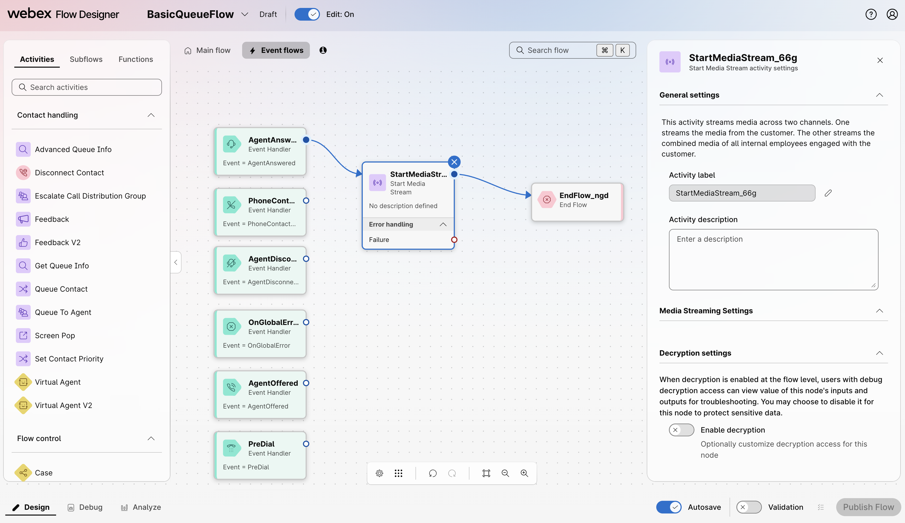
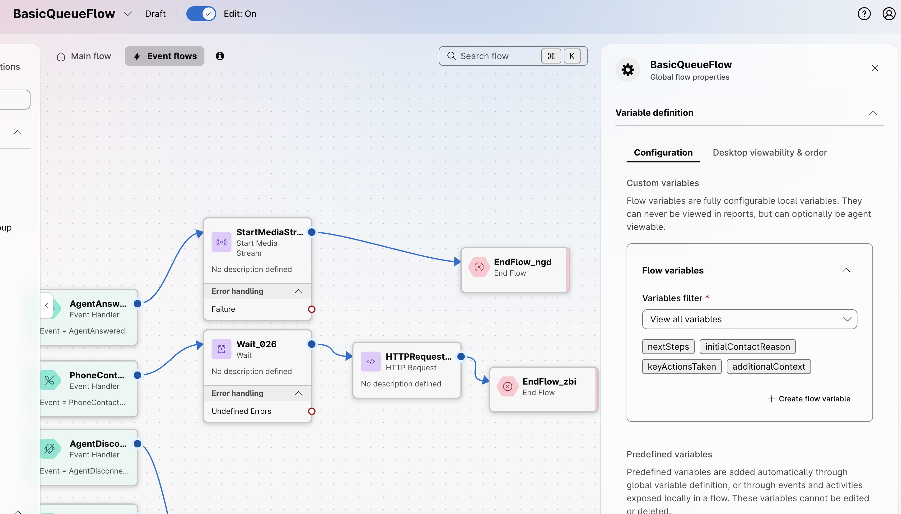

# Lab 1 - Using Bruno and the WxCC HTTP Connector :hammer_and_wrench:

In this lab, you will learn two ways to interact with the Webex Contact Center (WxCC) APIs:

1. **From a laptop**, using the Bruno API client.
2. **From within a WxCC flow**, using the WxCC HTTP Connector.

By the end of this lab, you will have:

- Created a Webex Integration App for OAuth-based API access.
- Sent your first API calls to WxCC from Bruno (both `GET` and `POST`).
- Configured the WxCC HTTP Connector in Control Hub.
- Built a flow that calls a WxCC API natively from Flow Designer to retrieve an AI-generated agent summary after a call ends.

---

## Lab 1.1 - Create a Webex App Integration

You will create a Webex Integration App to obtain a **Client ID** and **Client Secret**. These credentials are used by Bruno to perform an OAuth 2.0 authorization flow against the WxCC APIs.

???+ webex "Instructions"
    1. Navigate to the <a href="https://developer.webex.com" target="_blank">Webex for Developers</a> website.
    2. Click **Log In** in the top-right corner and use the **admin credentials** provided for your POD.
    3. Once logged in, click your avatar in the top-right corner and select **My Webex Apps**.
    4. Click **Create a New App**.
    5. Click **Create an Integration**.
    6. Fill out the integration form with the following values:
        - **Integration Name:** `WxCC API Lab`
        - **Icon:** Pick any icon.
        - **App Hub Description:** `WxCC API Lab Integration`
        - **Redirect URI(s):** `https://oauth.usebruno.com/callback`
        - **Scopes:** Check the following six scopes:
            ```
            cjp:config
            cjp:config_read
            cjp:config_write
            cjp:user
            cjds:admin_org_read
            cjds:admin_org_write
            ```
    7. Click **Add Integration** at the bottom of the page.
    8. On the confirmation page, **copy and save the Client ID and Client Secret** somewhere safe (e.g., a text file). You will need them in the next section.

        ???+ tip "Webex App Integration"
            <figure markdown>
            
            </figure>

    !!! warning "Client Secret"
        The Client Secret is shown only once. If you lose it, you will need to regenerate it from the integration settings page.

---

## Lab 1.2 - Configure Bruno to Send API Calls to WxCC

!!! note
    Full API documentation for Webex Contact Center is available <a href="https://developer.webex.com/webex-contact-center/docs/webex-contact-center" target="_blank">here</a>.

???+ webex "Instructions"
    Open Bruno on your lab laptop. The WxCC API collection was already imported during the **Getting Started** section.

    1. In the left panel, click on the collection name to open its settings.
    2. Click on the **Vars** tab.
    3. Update the value on the following variables:

        - **`client_id`** — The Client ID from the Webex App you created in Lab 1.1.
        - **`client_secret`** — The Client Secret from the Webex App you created in Lab 1.1.
        - **`org_id`** — The Organization ID for your lab tenant (provided in your POD credentials).

    4. Click on the **Auth** tab (next to the Variables tab) and scroll to the bottom.
    5. Click the **Get Access Token** button.
    6. A Webex login window will pop up. Enter the **admin credentials** provided for your POD (the same ones used to create the Webex App integration in Lab 1.1).
    7. When prompted, **accept** the requested permissions.
    8. Bruno will receive an **Access Token** and a **Refresh Token** via the redirect URL you configured. You can now use this token to send API calls to WxCC. Bruno will automatically refresh the token when it expires.

        ???+ info "Get New Access Token"
            <figure markdown>
            
            </figure>

---

## Lab 1.3 - Sending API Calls to WxCC from Bruno

In this section, you will send your first API calls to the WxCC platform. You will:

1. **List Entry Points** — a read-only call to confirm authentication is working.
2. **Create a Wrap-up Code** — a write call to confirm you can also modify tenant configuration.
3. **Verify the Wrap-up Code** in Control Hub.

### Step 1: List All Entry Points

???+ webex "Instructions"
    1. In the left navigation pane of Bruno, expand the **WxCC API Collection**.
    2. Locate and click on the **GET** request named **`List Entry Points`**. This opens the request in a new tab.
    3. Click the **Send** button (arrow icon) to execute the request.
    4. In the **Response** panel, you should see a `200 OK` status and a JSON response containing an array of Entry Points configured in your tenant.

        ???+ info "List Entry Points"
            <figure markdown>
            
            </figure>

    !!! success "Checkpoint"
        If you receive a `200 OK` response with a list of entry points, your Bruno authentication is working correctly. If you receive a `401 Unauthorized` response, return to Lab 1.2 and refresh your access token.

### Step 2: Create a Wrap-up Code

You will now create a Wrap-up Code named **`badExperience`**. Wrap-up codes are presented to agents at the end of a call to categorize the interaction outcome.

Creating a Wrap-up Code requires a `workTypeId`, which references the **Work Type** the code belongs to. Before sending the `Create Wrap-up Code` request, you must first retrieve the ID of the **Default Wrapup Work Type** by listing all Work Types in the tenant.

???+ webex "Retrieve and Create the Wrap-up Work Type ID"
    1. In the left navigation pane of Bruno, click the **GET** request named **`List Work Types`**.
    2. Click **Send** to execute the request.
    3. In the response, locate the object where `"workTypeCode"` is `"WRAP_UP_CODE"`. It should look similar to this:

        ```json
        {
            "id": "db1b317b-f458-4330-9212-c81a76eaa733",
            "name": "Default Wrapup Work Type",
            "description": "Default Wrapup Code Work Type",
            "workTypeCode": "WRAP_UP_CODE",
            "active": true,
            "systemDefault": true,
            "links": [],
            "createdTime": 1700608535000,
            "lastUpdatedTime": 1700608535000
        }
        ```

    4. Copy the value of the `id` field.
    5. In the Bruno collection, open the **Vars** tab and update the `workTypeId` variable.

        !!! note "Why two Work Types?"
            Your tenant has two default Work Types: one for **Idle Codes** (`IDLE_CODE`) and one for **Wrap-up Codes**  (`WRAP_UP_CODE`). Make sure you copy the ID for the `WRAP_UP_CODE` entry — using the wrong one will cause the next step to fail.

    1. In the left navigation pane, click the **POST** request named **`Create Wrap-up Code`**.
    2. Click on the **Body** tab to view the request payload.
    3. Confirm the request body matches the following details:

        ```json
        {
            "name": "badExperience",
            "description": "API Lab Recovery Test",
            "defaultCode": false,
            "active": true,
            "workTypeId": "{{workTypeId}}",
            "workTypeCode": "WRAP_UP_CODE"
        }
        ```

    4. Click **Send** to execute the request.
    5. You should receive a `200 OK` response containing the details of the newly created Wrap-up Code, including its `id`.

        ???+ info "Create Wrap-up Code"
            <figure markdown>
            
            </figure>

### Step 3: Verify in Control Hub

???+ webex "Instructions"
    1. Open <a href="https://admin.webex.com" target="_blank">https://admin.webex.com</a> in a new browser tab and log in with the admin credentials for your POD.
    2. In the left navigation pane, go to **Services > Contact Center**.
    3. In the Contact Center menu, navigate to **Idle/Wrap-up Codes**.
    4. Confirm that your `badExperience` wrap-up code appears in the list.

    !!! success "Checkpoint"
        You have successfully sent both **GET** and **POST** API calls to WxCC, and verified the change in Control Hub. Bruno is now fully configured for the rest of the lab.

---

## Lab 1.4 - Calling APIs using the WxCC HTTP Connector

So far, you have called WxCC APIs from your laptop using Bruno. In real-world deployments, the most common place to call APIs is from inside a **WxCC flow** — for example, to enrich a call with external context, or to retrieve data generated during the call itself.

???+ curious "**What is the HTTP Connector?**"
    The HTTP Connector is a Control Hub object that holds the authentication context (scopes and credentials) for calling WxCC APIs from within Flow Designer. Once configured, you can drop an **HTTP Request** activity into any flow and select the connector — token management is handled automatically.

In this section, you will:

1. **Enable the AI Features** required to generate agent summaries.
2. **Configure Real-Time Transcription (RTT)** in the existing flow — RTT is a prerequisite for summary generation.
3. **Create the HTTP Connector** in Control Hub.
4. **Extend the existing flow** to call the List Summaries API after the call ends.
5. **Test** the end-to-end behavior.

---

### Step 1: Enable AI Features in Control Hub

Before any agent summary can be retrieved via API, the **Generated Summaries** feature must be enabled in Control Hub. Summaries are produced from the call transcript, so **Real-Time Transcription** must also be enabled.

???+ webex "Instructions"
    1. In **Control Hub**, navigate to **Services > Contact Center**.
    2. In the Contact Center menu, click **AI Features**.
    3. Locate the **Generated Summaries** toggle and enable it.
    4. Select all available summarization types and make sure the **Apply to all queues** toggle is on.  
    6. Locate the **Real-Time Transcription** toggle and enable it.
    7. Click **Save**.

        ???+ tip "AI Features scope"
            In a production deployment, you could scope summarization and RTT to specific queues to control cost and ensure relevance.

        ???+ info "AI Features Configuration"
            <figure markdown>
            
            </figure>

    !!! warning "Both features are required"
        Enabling **Generated Summaries** alone is not enough — the summary engine relies on the transcript produced by **Real-Time Transcription**. Both toggles must be on, and RTT must also be configured in the flow itself (Step 2 below).

---

### Step 2: Configure Real-Time Transcription in the Flow

Enabling RTT in Control Hub is only half of the configuration. The flow must also include a **Start Media Stream** activity in the Event Flows canvas, otherwise the audio will not be sent to the transcription service.

You will add this configuration to the existing `BasicQueueFlow` flow.

???+ webex "Open the existing flow"
    1. In Control Hub, navigate to **Contact Center > Flows**.
    2. Locate `BasicQueueFlow` in the flow list and click on it.
    3. Toggle the **Edit** switch at the top of the canvas to enter edit mode.

???+ webex "Add the Start Media Stream activity"
    1. At the top of the Flow Designer, switch from the **Main Flow** view to the **Event Flows** view.
    2. Locate the event handler node for **AgentAnswered**.

        !!! note "Event name change"
            Flow Designer is releasing an updated UX in which the **AgentAnswered** event has been renamed to **AgentAccepted**. Either event can be used to start the media stream required for RTT — use whichever appears in your tenant.

    3. From the **Activities Library**, drag a **Start Media Stream** activity onto the canvas.
    4. Connect the **AgentAnswered** (or **AgentAccepted**) event handler to the **Start Media Stream** activity.
    5. From the Activities Library, drag an **End Flow** activity onto the canvas.
    6. Connect the output of **Start Media Stream** to the **End Flow** activity.

        ???+ info "Start Media Stream branch"
            <figure markdown>
            
            </figure>

    !!! note "Leave edit mode open"
        You will continue editing this flow in Step 4 to add the API call. Do not publish yet.

---

### Step 3: Create the HTTP Connector

???+ webex "Instructions"
    1. In a browser, log in to <a href="https://admin.webex.com" target="_blank">Webex Control Hub</a> with your POD admin credentials.
    2. In the left navigation pane, go to **Services > Contact Center**.
    3. In the Contact Center menu, click **Integrations**.
    4. On the **Integrations** page, locate the card labeled **Webex Contact Center** and click **Add Connector**.
    5. In the connector configuration form, fill in the following:

        | Field | Value |
        |---|---|
        | **Name of the connector** | `WxCC_API_PODXX` *(replace XX with your POD number)* |
        | **Access** | `Read-Write` |

    6. Under the **Authorization** section, click **Authorize**. 
    7. Click **Add Connector**.

        ???+ info "HTTP Connector configuration"
            <figure markdown>
            
            </figure>


---

### Step 4: Add the Wrap-Up Summary Retrieval to the Flow

Your tenant already has a working voice flow named **`BasicQueueFlow`** that:

- Greets the caller.
- Queues the contact to a queue routed to **User1** (your test agent).
- Ends the flow when the call disconnects.

In Step 2 you added Real-Time Transcription to the **AgentAnswered** event branch. You will now extend the **PhoneContactEnded** event branch to retrieve the AI-generated agent summary via API.

**Why this is interesting:**
WxCC can automatically generate a textual summary of an agent's interaction with a customer — capturing key points, customer sentiment, and resolution status. This summary is created **after the call ends**, once the AI has had time to process the transcript and the agent has submitted their wrap-up. By calling the **List Summaries API** from within the flow, you can retrieve that summary programmatically and pass it to downstream systems — for example, to attach it to a CRM record, send it to a supervisor, or feed it into another workflow.

**What you will add to the flow:**

1. A **delay**, to wait for the summary to be generated and the agent to submit wrap-up.
2. An **HTTP Request** to the List Summaries API, using the `interactionId` of the call.
3. An **End Flow** node to close the event branch.

???+ webex "Create the flow variables"
    Before the HTTP Request activity can write the parsed summary fields anywhere, the flow needs four custom variables to hold them. You will create these as **Custom Flow Variables** so they are accessible from any activity in the flow.

    1. In the Flow Designer, click on the **Global Flow Properties** panel (the gear icon in the top-right of the flow editor).
    2. Under **Custom Flow Variables**, click **Create flow variable**.
    3. Create the following four variables, one at a time:

        | Variable Name | Type | Default Value | Agent Viewable | Desktop Label |
        |---|---|---|---|---|
        | `nextSteps` | `String` | *(empty)* | No | N/A |
        | `initialContactReason` | `String` | *(empty)* | No | N/A |
        | `keyActionsTaken` | `String` | *(empty)* | No | N/A |
        | `additionalContext` | `String` | *(empty)* | No | N/A |

        ???+ info "Custom Flow Variables"
            <figure markdown>
            
            <figcaption>The four summary variables declared under Global Flow Properties.</figcaption>
            </figure>

???+ webex "Locate the PhoneContactEnded event and Add a Delay node"
    1. From the **Event Flows** view of `BasicQueueFlow`, locate the event handler node for **PhoneContactEnded**.

        !!! note "Why PhoneContactEnded?"
            The `PhoneContactEnded` event fires when the call has fully terminated — after the customer hangs up and the connection is closed. This is the appropriate trigger for any post-call activity that does not need to interact with the agent during wrap-up.

    2. Confirm that no other activities are currently connected to this event handler. You will be building this branch from scratch.
    1. From the **Activities Library**, drag a `Wait` node onto the canvas.
    2. Connect the **PhoneContactEnded** event handler to this activity.
    3. Configure a wait time of `2 minutes`.
    
        The agent summary is not available immediately at the moment of disconnection — the AI needs a couple of seconds to process the  realt-time transcript, and the agent typically submits their wrap-up code shortly after the call ends. To give the system time to produce the summary, the flow needs to wait before making the API call.
        
        !!! warning "Tuning the delay"
            For production environments, the wait time will depend in the use case and agent best practices. It is recommended to follow the guideline from the Auto Wrap-Up timer configured in the tenant, if the agents are given 3 minutes to enter their notes, then configure the wait time to a few seconds over 3 minutes. 

???+ webex "Add the HTTP Request activity"
    1. From the **Activities Library**, drag an **HTTP Request** activity onto the canvas.
    2. Connect the delay activity to the **HTTP Request** activity.
    3. Click on the **HTTP Request** activity. On the right-hand panel, configure the following:

        | Field | Value |
        |---|---|
        | **Activity Label** | `GetAgentSummary` |
        | **Use Authenticated Endpoint** | Enabled (toggle ON) |
        | **Connector** | `WxCC_API_PODXX` *(the one you created in Step 3)* |
        | **Request Path** | `/generated-summaries/search` |
        | **Method** | `POST` |
        | **Headers** | `Content-Type: application/json` |

    4. Set the **Request Body** to the following JSON. Enter your organization ID in the **orgId** field: 

        ```json
        {
          "interactionId": "{{NewPhoneContact.InteractionId}}",
          "orgId": "REPLACE_ORG_ID",
          "searchType": "INTERACTION"
        }
        ```
    1. Scroll to the **Parse Settings** section.
    2. Add the following four output variables. Click **+ Add** after each one to create the next:

        | Output Variable Name | Path Expression | Variable Type |
        |---|---|---|
        | `nextSteps` | `$.summaries.POST_CALL.*.nextSteps` | `String` |
        | `initialContactReason` | `$.summaries.POST_CALL.*.initialContactReason` | `String` |
        | `keyActionsTaken` | `$.summaries.POST_CALL.*.keyActionsTaken` | `String` |
        | `additionalContext` | `$.summaries.POST_CALL.*.additionalContext` | `String` |


    !!! note Wrap-Up Summary Info
        The List Summaries API returns a structured JSON object that breaks the agent summary into four distinct fields. Rather than capturing the whole response as a single string, you will create one flow variable per field. This makes it easier to use each piece of context independently in downstream activities.
        
        Below is a sample response showing the structure you will be parsing:

        ```json
        {
          "orgId": "d8181bb6-...-4bdc67eae571",
          "interactionId": "390cde87-...-1e971ed7c823",
          "searchType": "INTERACTION",
          "summaries": {
            "POST_CALL": {
              "d8181bb6-...:390cde87-...:a05840c5-...": {
                "nextSteps": "Caller to confirm later if they want to hold the payment plan.",
                "initialContactReason": "Customer wants to set up a payment plan.",
                "keyActionsTaken": "Set up payment plan for $100 this month.",
                "additionalContext": "The caller intends to make a payment of $100 this month and $200 next month, but is considering putting the payment on hold."
              }
            }
          }
        }
        ```

    !!! note "About the wildcard in the path"
        The key under `POST_CALL` is a composite identifier built from the `orgId`, `interactionId`, and an internal record ID — it is different on every call. Using `*` as a wildcard in the JSONPath expression lets you target the fields without needing to know the exact key.


    ???+ gif "Parse Settings configuration"
        <figure markdown>
        
        <figcaption>Four output variables mapped to the individual summary fields.</figcaption>
        </figure>

???+ webex "Publishing the Flow"
    1. From the Activities Library, drag an **End Flow** activity onto the canvas.
    2. Connect the **output** of the `GetAgentSummary` HTTP Request to the **End Flow** activity.
    1. Enable the **Validation** slider at the bottom of the canvas.
    2. Confirm there are no validation errors.
    3. Click **Publish Flow** and select **Latest** as the version label.

---

### Step 5: Test the Flow

???+ webex "Place a test call"
    1. Sign in to the **Agent Desktop** as your test agent using the **User1** credentials provided for your POD.
    2. Place the agent in an **Available** state.
    3. From your phone, call the **Entrypoint number** provided in your POD credentials.
    4. Have a short conversation with the agent (15–30 seconds is enough for a summary to be generated). Speak clearly and use a few full sentences so there is meaningful content to summarize.
    5. End the call.
    6. As the agent, submit a wrap-up code on the Agent Desktop.
    7. Wait for the configured delay to expire for the API call to fire.

???+ webex "Inspect the response"
    1. In Control Hub, navigate to **Contact Center > Flows** and open `BasicQueueFlow`.
    2. Open the **Flow Debugger**.
    3. Locate the most recent execution of the flow.
    4. Click on the `GetAgentSummary` activity to view both the raw response and the parsed output variables.
    5. Confirm that each of the four output variables holds a meaningful value:

        | Variable | Expected Content |
        |---|---|
        | `nextSteps` | A short statement of what should happen after the call. |
        | `initialContactReason` | The reason the customer originally contacted the center. |
        | `keyActionsTaken` | A summary of what the agent did during the call. |
        | `additionalContext` | Any extra details captured from the conversation. |

    !!! success "Checkpoint"
        You have successfully called a WxCC API natively from a Flow Designer flow using the HTTP Connector. The flow waited for the agent summary to be generated, retrieved it via API, and parsed each section of the summary into a dedicated flow variable — ready to be used by any downstream activity.

    ???+ failure "Troubleshooting"
        - **All four variables empty, but the raw response contains a summary**: The JSONPath expressions did not match. Confirm that you used `*` as the wildcard between `POST_CALL` and the field name, and that the field names are spelled exactly as shown.
        - **Raw response contains an empty `summaries` object**: Confirm that **Generated Summaries** and **Real-Time Transcription** are enabled in Control Hub (Step 1) and that the **Start Media Stream** activity is wired to the **AgentAnswered** event (Step 2). If both are configured, increase the delay and try again.
        - **HTTP 401 / 403**: Re-authorize the HTTP Connector in Control Hub (Step 3).
        - **HTTP 400 - Bad Request**: Verify the request body fields match the schema exactly (`interactionId`, `orgId`, `searchType` — case-sensitive).
        - **HTTP 404**: Confirm the request path matches the documented endpoint.
        - **No record in flow debugger**: Confirm the entry point is pointing to `BasicQueueFlow` with the **Latest** version label.

---

## Summary

In this lab, you have:

- ✅ Created a Webex Integration app to obtain OAuth credentials.
- ✅ Configured Bruno with the required variables and obtained an access token.
- ✅ Sent **GET** and **POST** API calls to the WxCC platform from Bruno.
- ✅ Created a **Wrap-up Code** in your tenant via API.
- ✅ Configured the **WxCC HTTP Connector** in Control Hub.
- ✅ Built and tested a flow that retrieves an AI-generated agent summary from within Flow Designer.

You now have two complementary ways to interact with WxCC APIs — externally (Bruno) and natively (HTTP Connector). Both will be used throughout the rest of this lab.

**Congratulations! You have completed Lab 1.** Use the navigation menu on the left to proceed to **Lab 2**.
