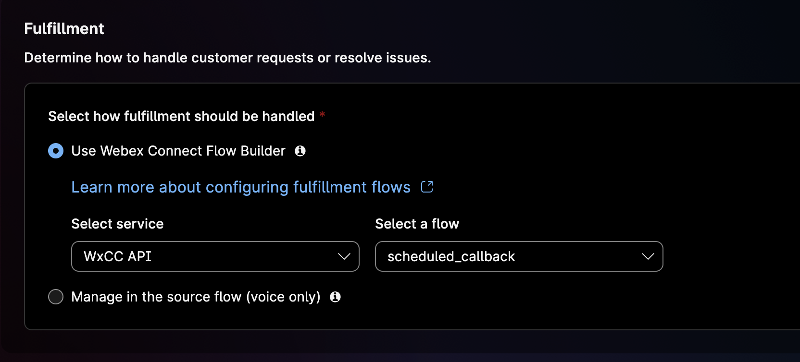
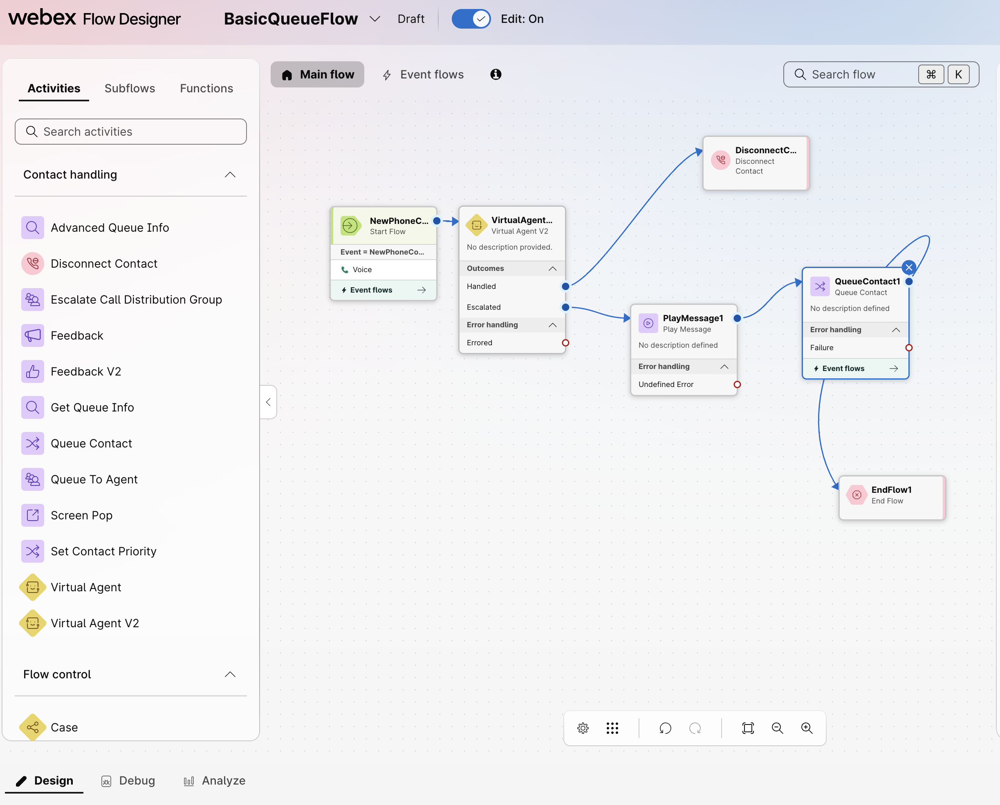

# Lab 2: Invoking WxCC APIs via Webex Connect & AI Agent

## Lab Purpose

In **Lab 1**, you learned two ways to interact with WxCC APIs:

- **Bruno** — for direct, developer-style API calls.
- **WxCC Flow Designer** — using the HTTP Request node inline within the `BasicQueueFlow`.

In **Lab 2**, you will explore a **third pattern**: invoking WxCC APIs from **Webex Connect**, triggered by a **Webex AI Agent**. This pattern lets the AI Agent collect customer details and call the WxCC Callback API during a live customer interaction.

The use case: A customer calls in via PSTN and reaches an **AI Agent** instead of a live agent. When the customer asks for a human, the AI Agent offers to schedule a callback instead of transferring the customer directly to a queue. If the customer accepts, the AI Agent collects the required details and schedules a callback through the WxCC Callback API.

???+ purpose "Lab Objectives"
    The purpose of this lab is to demonstrate how an Autonomous AI Agent can orchestrate real WxCC API operations through Webex Connect fulfillment flows.

    Key objectives include:

    *   **App Integration:** Create a **Webex App Integration** to authorize Webex Connect against WxCC APIs.
    *   **Custom Node:** Build a reusable **Custom Node** in Webex Connect that wraps the WxCC Callback API.
    *   **AI Agent Import:** Import a prebuilt **Autonomous AI Agent** with a callback-scheduling persona and slot filling.
    *   **Fulfillment Flow:** Build a **Webex Connect Service Flow** to fulfill the AI Agent's request and invoke the WxCC API.
    *   **Voice Integration:** Modify the **BasicQueueFlow** from Lab 1 to route inbound PSTN calls to the AI Agent.
    *   **End-to-End Validation:** Test the full workflow by **calling in via PSTN**.


???+ note "Production vs. Lab Environment"
    In a real production environment, the AI Agent would typically check the current queue wait time **before** offering a callback, only suggesting one when the wait is genuinely long. We are skipping this step in our lab because wait times in a lab tenant are always near-zero, which would make the logic uninteresting to test. The AI Agent in this lab will offer a callback unconditionally when a human is requested.

---

## Lab Overview

In this lab you will perform the following tasks:

1. Create a Webex App Integration for Webex Connect.
2. Build a reusable WxCC Custom Node in Webex Connect.
3. Import the "Callback Assistant" Autonomous AI Agent.
4. Build the Webex Connect fulfillment flow.
5. Test the AI Agent in Preview.
6. Modify the `BasicQueueFlow` to route calls to the AI Agent.
7. Test the complete scenario end-to-end via PSTN.

---

## Lab 2.1 - Create a Webex App Integration for Connect

In this first step, you will create the OAuth identity that allows Webex Connect to call WxCC APIs on behalf of your organization. Each external client (Bruno, Connect, custom apps) should have its own Integration so that scopes, tokens, and audit trails stay cleanly separated.

???+ webex "Instructions"
    1. Navigate to the <a href="https://developer.webex.com" target="_blank">Webex for Developers</a> website.
    2. Click **Log In** in the top-right corner and use the **admin credentials** provided for your POD.
    3. Once logged in, click your avatar in the top-right corner and select **My Webex Apps**.
    4. Click **Create a New App**.
    5. Click **Create an Integration**.
    6. Fill out the integration form with the following values:
        - **Integration Name:** <copy>`Connect-WxCC Integration`</copy>
        - **Icon:** Pick any icon.
        - **App Hub Description:** <copy>`Allows Webex Connect to invoke WxCC Callback APIs.`</copy>
        - **Redirect URI(s):** <copy>`https://ltrcct2009pod{XX}.us.webexconnect.io/callback`</copy>
        - **Scopes:** Check the following four scopes:
            ```
            cjp:config
            cjp:config_read
            cjp:config_write
            cjp:user
            ```
    7. Click **Add Integration** at the bottom of the page.
    8. On the confirmation page, **copy and save the Client ID and Client Secret** somewhere safe. You will need them in Lab 2.2.

    ???+ warning
        The Client Secret is shown only once. If you lose it, you'll need to regenerate it.

    ???+ tip "Why a separate Integration?"
        In Lab 1, you used a Webex Integration for Bruno. Each external client (Bruno, Connect, custom apps) should have its own Integration so that scopes, tokens, and audit trails stay cleanly separated.

---

## Lab 2.2 - Build the WxCC Custom Node in Webex Connect

Webex Connect uses **Custom Nodes** to wrap REST APIs into reusable flow components. In this section, you will build one that wraps the WxCC scheduled callback API so it can be used in the fulfillment flow.

???+ webex "Create the Webex Connect Service"

    1. Go to **Control Hub** → **Contact Center** → **Overview** and under Digital Channels launch **[Webex Connect]**.
    2. Create a new Service for this lab:

        - Click on **[Create New Service]**
        - Give it a name <copy>`WxCC API`</copy> and click on **[Create]**

    2. From the menu on the left hand side, navigate to **Assets > Integrations**.
    3. Click **Add Integration** and select **Custom Node**.

    ???+ download "Download the WxCC Custom Node Icon"
        Download the custom node icon before configuring the node: <a href="../assets/wxcc_custom.svg" download>`wxcc_custom.svg`</a>

        If the SVG opens in the browser instead of downloading, right-click the link and save the file as `wxcc_custom.svg`.

    4. Configure the new node:

        | Field | Value |
        | :--- | :--- |
        | **Node Icon** | Upload the downloaded `wxcc_custom.svg` file |
        | **Node Name** | <copy>`WxCC_API`</copy> |
        | **Description** | <copy>`Schedules a callback in Webex Contact Center.`</copy> |
        | **Node Category** | <copy>`WxCC`</copy> |
        | **Creation Type** | `Create a blank integration` |

    5. Click **[OK]**. The new node opens so you can add the API method.

    ???+ info "HTTP Connector configuration"
        <figure markdown>
        
        </figure>

???+ webex "Confirm the Queue-1 ID"
    The `ScheduleCallback` method uses the lab queue `Queue-1`. Each POD has its own Queue ID, so you must copy the value from your tenant before configuring the Custom Node method body.

    1. In Control Hub, go to **Contact Center** > **Queues**.
    2. Open **Queue-1**.
    3. Copy the ID shown under the queue name.
    4. Save this value temporarily. You will paste it into the `queueId` field in the next section.

    !!! warning
        Do not use another attendee's Queue ID. The value is unique per POD.

???+ webex "Add the ScheduleCallback method"
    1. Inside the **WxCC_API** node, click **Add Method**
    2. Configure the **Request Details** section:

        | Field | Value |
        |---|---|
        | **Request Name** | `ScheduleCallback` |
        | **Request Timeout (ms)** | `5000` |
        | **Connection Timeout (ms)** | `5000` |
        | **Type** | `Post` |
        | **Resource URL** | `https://api.wxcc-us1.cisco.com/v1/callbacks/organization/$(orgId)/scheduled-callback` |

    3. Click **Parse Variables** (next to the Resource URL field). Add the following parameter:

        | Parameter | Parameter Value Type | Parameter Value |
        |---|---|---|
        | `orgId` | `Static` | *(paste your Organisation ID from your POD credentials)* |

    4. Configure the **Authorization** section:

        | Field | Value |
        |---|---|
        | **Type** | `OAuth 2.0` |
        | **Grant Type** | `Authorization Code` |
        | **Consumer ID** | *(Client ID from the Webex Integration you created in Lab 2.1)* |
        | **Consumer Secret** | *(Client Secret from the Webex Integration you created in Lab 2.1)* |
        | **Authorization URL** | `https://webexapis.com/v1/authorize` |
        | **Scope** | `cjp:config cjp:config_read cjp:config_write cjp:user` |
        | **Access Token URL** | `https://webexapis.com/v1/access_token` |
        | **Validity** | `1209599` |
        | **Refresh Token URL** | `https://webexapis.com/v1/access_token` |
        | **Client Authentication** | `Send client credentials in body` |

    5. Under **Advance Settings**, confirm the following are set:

        | Field | Value |
        |---|---|
        | **Access Token URL Method** | `POST` |
        | **Access Token URL Parameter type** | `Body` |
        | **Access Token URL Parameters — Name** | `grant_type` |
        | **Access Token URL Parameters — Value** | `authorization_code` |

    6. Click **Get Access Token**. A Webex login window will appear — sign in using your POD admin credentials. Accept the requested permissions. Your **Access Token** and **Refresh Token** will populate automatically.

    7. Configure the **Headers** section:

        | Parameter | Parameter Value Type | Parameter Value |
        |---|---|---|
        | `Content-Type` | `Static` | `application/json` |

    8. Configure the **Body** section. Set the content type to `JSON (application/json)` and paste in the following:

        ```json
        {
          "customerName": "$(name)",
          "callbackNumber": "$(callback_number)",
          "timezone": "America/New_York",
          "scheduleDate": "$(date)",
          "startTime": "$(start_time)",
          "endTime": "$(end_time)",
          "queueId": "REPLACE_WITH_QUEUE_1_ID",
          "callbackReason": "$(reason)"
        }
        ```

    9. Click **Parse** (inside the Body section). Configure the six dynamic input parameters:

        | Parameter | Parameter Value Type | Field Name |
        |---|---|---|
        | `name` | `Dynamic` | `Name` |
        | `callback_number` | `Dynamic` | `Callback Number` |
        | `date` | `Dynamic` | `Date` |
        | `start_time` | `Dynamic` | `Start Time` |
        | `end_time` | `Dynamic` | `End Time` |
        | `reason` | `Dynamic` | `Reason` |

    10. Configure the **Response** section. Under **Configure Node Events**, confirm the following is set:

        | Node Event | Body | Response Path | Condition | Value | Node Edge |
        |---|---|---|---|---|---|
        | `Success` | `HTTP Status` | *(blank)* | `starts with` | `2` | `Success` |
        | `Failure` | `HTTP Status` | *(blank)* | `starts with` | `4` | `Error` |
        | `Unavailable` | `HTTP Status` | *(blank)* | `starts with` | `5` | `Error` |

    11. Under **Set data to be returned in a flow session**, add the following response parameter:

        | Parameter Name | Body | Response Path |
        |---|---|---|
        | `response_body` | `Body` | `$` |

    12. Click **[Save]**.

    ???+ gif "Scheduled Callback Method"
        <figure markdown>
        
        <figcaption>Scheduled Callback method configuration.</figcaption>
        </figure>


???+ webex "Test the Custom Node"
    1. Inside the **WxCC_API** node, click **[Test]**.
    2. Select the **ScheduleCallback** method.
    3. Enter sample values:

        | Field | Example |
        | :--- | :--- |
        | `Name` | <copy>`Jane Smith`</copy> |
        | `Callback Number` | <copy>`5554443322`</copy> |
        | `Date` | Today's date in `YYYY-MM-DD` format |
        | `Start Time` | A time at least 30 minutes in the future, `HH:mm:ss` |
        | `End Time` | A time at least 30 minutes after start time, `HH:mm:ss` |
        | `Reason` | <copy>`Customer requested a scheduled callback from the AI Agent.`</copy> |

    4. Click **[Test]** and confirm a successful `2xx` response.

    !!! success "Checkpoint"
        You now have a reusable Webex Connect Custom Node that can schedule callbacks in WxCC. Lab 2.4 will call this node from the AI Agent fulfillment flow.

    ???+ failure "Troubleshooting"
        - **401 / 403**: Re-authorize the Custom Node and confirm the Lab 2.1 Integration includes `cjp:config`, `cjp:config_read`, `cjp:config_write`, and `cjp:user`.
        - **400 - Invalid request**: Confirm `date`, `start_time`, and `end_time` use the expected formats and that the start time is at least 30 minutes in the future.
        - **Invalid queue**: Confirm the `queueId` matches `Queue-1` in your POD.


---

## Lab 2.3 - Import the "Callback Assistant" AI Agent

In this section, you will import the prebuilt *Callback Assistant* AI Agent. The imported agent already contains the persona, instructions, and the `schedule_callback` fulfillment action used later in this lab.

???+ download "Download the Callback Assistant Import File"
    Download the AI Agent import file: <a href="../assets/Callback%20Assistant.json" download>`Callback Assistant.json`</a>

    If the JSON opens in the browser instead of downloading, right-click the link and save the file as `Callback Assistant.json`.

???+ webex "Import the AI Agent"

    1. From [Control Hub](https://admin.webex.com), navigate to **Contact Center** and under **Quick Links** click **Webex AI Agent**. The Webex AI Agent Studio opens in a new window.
    2. Click **Import agent**.
    3. Upload the downloaded `Callback Assistant.json` file.
    4. Complete the import workflow and open the imported **Callback Assistant** agent.
    5. Confirm the agent is not published yet. You will publish it after the fulfillment flow is connected and tested.

???+ webex "Review the Imported Agent"

    1. Open the imported **Callback Assistant** agent.
    2. Confirm the **Welcome message** is configured:

        ```text
        Thanks for calling Webex Contact Center! How can I help you today?
        ```

    3. Open the **Actions** tab and confirm the `schedule_callback` action exists.
    4. Confirm the action has the following input entities:

        | Entity Name | Required | Purpose |
        | :--- | :--- | :--- |
        | `name` | Yes | Customer name for the scheduled callback |
        | `mobile_number` | Yes | Callback phone number collected by the AI Agent |
        | `date` | Yes | Callback date requested by the caller |
        | `start_time` | Yes | Callback window start time requested by the caller |
        | `end_time` | Yes | Callback window end time requested by the caller |
        | `reason` | No | Optional callback reason |

    !!! warning
        Do not publish the AI Agent yet. The imported action still needs to be connected to the Webex Connect fulfillment flow you will build in Lab 2.4.

    ???+ gif "Import AI Agent"
        <figure markdown>
        
        <figcaption>Import AI Agent-Callback Assistant</figcaption>
        </figure>

---

## Lab 2.4 - Build the Webex Connect Fulfillment Flow

When the AI Agent triggers `schedule_callback`, Webex Connect needs a flow to receive the collected callback details, normalize the callback phone number, and invoke the WxCC API via the Custom Node we built in Lab 2.2. In this section you will build that flow.

???+ webex "Action fulfillment flow in Webex Connect"

    1. Go to your *WxCC API* Service in Webex Connect.
    2. Click on **[Flows]** to create your fulfillment flow.

        - Click on **[Create Flow]**
        - Give your flow a name <copy>`schedule_callback`</copy>
        - Select **New Flow** under **Method**
        - Select **Start from Scratch**
        - Click on **[Create]**

    3. Configure the **Start Node** to trigger the flow from the AI Agent:

        - Select the **AI Agent Event**.
        - Set the **SAMPLE JSON** to the below:

            ```json
            {
                "start_time": "",
                "end_time": "",
                "date": "",
                "mobile_number": "",
                "name": "",
                "reason": ""
            }
            ```

            ???+ info
                The variable names in the JSON sample must match the corresponding **input entities** in the imported AI Agent action: `name`, `mobile_number`, `date`, `start_time`, `end_time`, and `reason`.

            !!! note
                This sample JSON is used to parse variables in Flow Builder. The values can stay empty because the AI Agent supplies the real values at runtime.

        - Click on **[Parse]**
        - Click on **[Save]**

        ???+ info
            Flows do not autosave, so make sure you save your flow whenever you make edits.

    4. Add an **Evaluate** node to normalize the phone number before sending it to WxCC.

        The AI Agent may collect the phone number with `+`, spaces, parentheses, or hyphens. The WxCC API expects the callback number without formatting characters, so this node creates a cleaned variable named `phone_Number`.

        - Drag and drop an **Evaluate** node onto the canvas next to the **Start Node**.
        - Connect the green outlet of the **Start Node** to the **Evaluate** node.
        - Double-click the **Evaluate** node.
        - Paste the following JavaScript into the code editor:

            ```javascript
            var phone_Number = "$(n2.aiAgent.mobile_number)".replace(/\+/g, "")
            .replace(/ /g, "")
            .replace(/\(/g, "")
            .replace(/\)/g, "")
            .replace(/\-/g, "");

            1;
            ```

        - Set the **Script Output** value to `1`.
        - Set the **Branch Name** value to `Success`.
        - Click **[Save]**.
        - Save the flow.

        !!! warning
            The `n2` prefix refers to the Start Node ID and may be different in your flow. Pick `mobile_number` from the **Input Variables** panel if your node ID is different.

    5. Now we'll invoke the WxCC Callback API using the Custom Node we built in Lab 2.2.

        - Drag and drop the **WxCC_API** node onto the canvas next to the **Evaluate** node.
        - Connect the green outlet of the **Evaluate** node to the **WxCC_API** node.
        - Double-click on the node.
        - Set **Method Name** to <copy>`ScheduleCallback`</copy>.
        - Map the inputs as follows:

            | Custom Node Input | Mapped Value |
            | :--- | :--- |
            | `name` | <copy>`$(n2.aiAgent.name)`</copy> |
            | `callback_number` | <copy>`$(n5.phone_Number)`</copy> |
            | `date` | <copy>`$(n2.aiAgent.date)`</copy> |
            | `start_time` | <copy>`$(n2.aiAgent.start_time)`</copy> |
            | `end_time` | <copy>`$(n2.aiAgent.end_time)`</copy> |
            | `reason` | <copy>`$(n2.aiAgent.reason)`</copy> |

            ???+ warning
                The `n2` and `n5` prefixes refer to node IDs and may be different in your flow. Pick the variables from the **Input Variables** right panel rather than typing them manually. The callback number should come from the `phone_Number` variable created by the **Evaluate** node.

        - Click on **[Save]**.
        - Save the flow.

    6. To complete the flow, click on the green outlet at the right of the Custom Node and drag it to the canvas. Release it to open the **End** dialogue:

        - Set the **Node Event** value to `onSuccess`.
        - Set the **Flow Result** value to `101 - Successfully completed flow [Success]`.
        - Click on **[Save]**.
        - Open the **Transition Actions (Optional)** tab for the **End** node.
        - Click **+ Add Action** and configure the action:

            | Field | Value |
            | :--- | :--- |
            | **Time** | `On-enter` |
            | **Action** | `Set variable` |
            | **Variable** | `result` |
            | **Value** | `Callback Scheduled` |

        - Save the flow.

    7. To finish your fulfillment flow, you need to pass the output variables back to the AI Agent. This is done through the **Flow Outcomes**.

        ???+ info
            The AI Agent is notified of flow completion. By default, the notification for AI Agent is enabled under the flow setting with the default payload. On flow completion, you can update the payload shared with the AI Agent using the **Flow Outcomes**.

        - Click on the :fontawesome-solid-gear: button at the top right of the flow editor.
        - Click on the **Flow Outcomes** tab.
        - Open the **Last Execution Status** Outcome.
        - Confirm **Notify AI Agent** is selected.
        - Select **Enter key and value**.
        - Click on **+ Add New** for each variable below. Pick the values from the **Input Variables** right panel under the appropriate node section:

            |		Key		|	Value	|
            |		-----		|	-----	|
            |	<copy>`transactionID`</copy>	|	<copy>`$(transid)`</copy>	|
            |	<copy>`flowname`</copy>	|	<copy>`$(flowname)`</copy>	|
            |	<copy>`serviceName`</copy>	|	<copy>`$(serviceName)`</copy>	|
            |	<copy>`statuscode`</copy>	|	<copy>`1000`</copy>	|
            |	<copy>`result`</copy>	|	<copy>`$(result)`</copy>	|
            |	<copy>`response`</copy>	|	<copy>`$(n3.response_body)`</copy>	|

            Note the numbering for your variables might be different. Make sure `response` corresponds to the response body from your **WxCC_API** node.

        - Click on **[Save]**.
        - Save the flow.

    Your **schedule_callback** flow is now completed.

    Before leaving the flow editor, make sure you **[Make Live]** the flow, otherwise it will not be visible to the AI Agent Studio.

???+ webex "Link the flow back to the AI Agent action"

    1. Return to **AI Agent Studio** → open your `Callback Assistant` agent → **Actions** tab → open `schedule_callback`.
    2. Under the **Fulfillment** section:
        - *Use Webex Connect Flow Builder* should already be selected.
        - Service: *WxCC API*
        - Flow: select the freshly published **schedule_callback** flow.
    3. Click **[Save]**

    ???+ info "Link Flow to Action"
        <figure markdown>
        
        </figure>

---

## Lab 2.5 - Test the AI Agent

Before going live with PSTN, validate that the Callback Assistant follows the programmed logic by using the **Preview** tool in the AI Agent Studio.

1. In the AI Agent Studio, click the **[Preview]** button at the top-right of the configuration page.
2. You can do a preview chat or a preview voice conversation. Initiate a session.
3. Verification checklist — confirm the Agent successfully executes the following logic:

    - **Greeting:** Does it warmly greet you and ask how it can help?
    - **Intent Detection:** When you say *"I'd like to talk to a real person"*, does it offer a callback?
    - **Slot Filling:** Does it collect your name, phone number, callback date, and callback time window naturally?
    - **Confirmation:** Does it read the details back before scheduling?
    - **Fulfillment:** Does it execute `schedule_callback` and read back the confirmed date and start time?

???+ bug "Troubleshooting your AI Agent"

    The **Sessions** option in the left navigation panel of your AI Agent configuration window provides a comprehensive record of all interactions between the AI agent and users. To view session details, click on an individual row in the sessions table. If the session is locked, click the **[Decrypt content]** button to view the data.

    ???+ Warning
        The **[Decrypt content]** button appears only if you have decrypt access within the AI Agent Studio. If you do not have access, ask your administrator to grant you decryption privileges.

    To debug the Webex Connect flow, use the **Flow Debugging** tool. Before debugging:

    - Click the :fontawesome-solid-gear: at the top-right of the flow editor next to **Save**.
    - On the **Flow Settings** screen enable *Descriptive Logs* in the **General** tab.
    - Then in the flow designer, click the **Bug** icon on the far-right navigation pane to open the debug panel.
    - Click **Decrypt Logs** above the search bar, then select an execution to inspect the per-node data flow.

???+ Important "PUBLISH YOUR AI AGENT"

    Once you have validated your AI Agent in Preview, you can **Publish** it.

    - In the **AI Agent configuration** page, click **[Publish]** at the top-right corner.
    - Provide a publishing comment in the next dialogue and click **Publish**.

    Your Agent is now operational and ready to be wired into the voice flow.

---

## Lab 2.6 - Connect the AI Agent to the Inbound Call

In this configuration step, you will modify the `BasicQueueFlow` from Lab 1 so inbound PSTN calls hit the AI Agent first. If the AI Agent successfully schedules a callback, the call ends. If the AI Agent escalates, the call falls back to the original queue path.

???+ webex "Delivering the inbound call to the Callback Assistant"

    1. Go to **Control Hub** → **Contact Center** → **Flows**.
    2. Open your flow **BasicQueueFlow**. Enable the **Edit** slider at the top of the canvas.
    3. Locate the starting call path:

        ```text
        NewPhoneContact → PlayMessage1 → QueueContact1 → EndFlow1
        ```

    4. From the *Activities Library* drag and drop a **Virtual Agent V2** to the right of the **NewPhoneContact** event.

        > Note the event may appear as **NewContact** in your flow.

    5. Insert the **Virtual Agent V2** node between **NewPhoneContact** and the existing **PlayMessage1** node:

        - Remove the connector from **NewPhoneContact** to **PlayMessage1**.
        - Connect **NewPhoneContact** to **Virtual Agent V2**.
        - Keep the existing **PlayMessage1 → QueueContact1 → EndFlow1** path in place.

    6. Click on the **Virtual Agent V2** node and configure the settings below in the *Activity Settings* panel on the right side of the canvas:

        - Click the pencil on the **Activity Label** and rename it to <copy>`AIAgent_Greeter`</copy>. Click the tick to save.
        - Provide an *Activity Description*.
        - Under *Conversational Experience*, set **Static Contact Center AI Config**.
        - Then in the *Contact Center AI Config* dropdown, select **Webex AI Agent (Autonomous)**.
        - In the *Virtual Agent* drop-down menu, select your imported AI Agent (`Callback Assistant`).
        - In the *Decryption Settings*, set the **Enable decryption** slider to ease troubleshooting during debugging. Make sure the **Enable decryption** slider is also set in the **Global Flow Properties** panel.

    7. Wire up the output branches:

        - **Handled** branch → connect to **Disconnect Contact** (the AI Agent successfully scheduled the callback, so the call can end).
        - **Escalated** branch → connect to **PlayMessage1** so the customer can still reach the original queue path.
        - Leave **PlayMessage1** connected to **QueueContact1**.
        - Leave **QueueContact1** connected to **EndFlow1**.

        Your final flow should be:

        ```text
        NewPhoneContact → Virtual Agent V2
        Virtual Agent V2 / Handled → Disconnect Contact
        Virtual Agent V2 / Escalated → PlayMessage1 → QueueContact1 → EndFlow1
        ```

    8. Enable the **Validation** check with the slider in the bottom right of the editor. If there are no errors, click **[Publish Flow]**.

    ???+ info "Flow with AI Agent"
        <figure markdown>
        
        </figure>

    

    ???+ info "No need to update the Routing Strategy"
        Because we modified `BasicQueueFlow` in place, your existing Routing Strategy from Lab 1 already points to it — no further changes are needed.

---

## Lab 2.7 - Test the complete scenario

You can now test the complete scenario end-to-end via PSTN.

1. Dial your **POD's PSTN number** (provided by the instructor).
2. Walk through this dialogue:

    | You (Caller) | Expected AI Agent Response |
    | :--- | :--- |
    | *(silence — agent greets first)* | *"Thanks for calling Webex Contact Center! How can I help you today?"* |
    | "I'd like to talk to a real person" | *"All our agents are currently helping other customers, but I'd be happy to schedule a callback for you. Can I get your full name?"* |
    | "Jane Smith" | *"Thanks Jane. What's the best phone number to call you back on?"* |
    | "919-555-1234" | *"What date would you like the callback?"* |
    | "Tomorrow" | *"What time window works best for you?"* |
    | "Between 3:30 PM and 4:30 PM Eastern" | *"Just to confirm — Jane Smith at 919-555-1234, tomorrow between 3:30 PM and 4:30 PM. Should I go ahead and schedule the callback?"* |
    | "Yes" | *(triggers fulfillment)* *"You're all set, Jane! We'll call you back tomorrow at 3:30 PM. Have a great day!"* |

3. **Verify the callback was created in WxCC from Bruno.**

    Open Bruno and run the scheduled callbacks `GET` request:

    ```
    GET /v1/callbacks/organization/{orgId}/scheduled-callback
    ```

    Confirm your newly scheduled callback appears in the response payload.

???+ Warning
    As the room environment may be noisy, please avoid using speaker mode for your calls to avoid unintended responses.

???+ success "Full-Circle Moment"
    The same `GET` API you tested in Bruno during Lab 1 now returns a callback that was created end-to-end by an **AI Agent talking to you over PSTN** and orchestrated by **Webex Connect**. That's the power of API-driven contact center architecture.

---

## Lab Completion ✅

You've now seen **three** different ways to invoke WxCC APIs:

| Method | Lab | Best For |
| :--- | :--- | :--- |
| Bruno | Lab 1 | Developer testing, ad-hoc calls |
| WxCC Flow Designer (HTTP Request) | Lab 1 | Inline API calls within voice/digital flows |
| Webex Connect + AI Agent | **Lab 2** | Conversational AI automation with reusable Custom Nodes |

At this point, you have built a fully automated **Callback Scheduling** experience that:

- [x] Uses a dedicated Webex Integration to securely authorize Webex Connect against WxCC APIs.
- [x] Wraps the WxCC Callback API in a reusable Custom Node.
- [x] Greets inbound PSTN callers with an Autonomous AI Agent.
- [x] Collects customer details via slot filling and triggers a Webex Connect fulfillment flow.
- [x] Schedules a real callback in WxCC and confirms it back to the caller.
- [x] Falls back gracefully to the live queue when the AI cannot handle the call.

**Congratulations!** You have successfully completed Lab 2 and are now ready to move on to the next Lab.

[Next Lab: Lab 3 - Event Subscriptions →](./lab3_subscriptions.md){ .md-button .md-button--primary }
