# Bonus Lab 4 - Proactive Outbound Reach 📞

## Lab Purpose

!!! info "Optional Bonus Lab"
    This lab is optional bonus material. The required three-hour-and-a-half workshop path is complete after Lab 3; continue here only if time allows or if you want to explore the full proactive outbound recovery workflow.

When a customer has a bad experience — whether from excessive hold time, poor sentiment, an unresolved issue, or a low survey score — waiting for them to call back is not an option. Every minute of delay increases churn risk. **Proactive outbound communication** is how modern contact centers close that loop before the customer walks away.

In this bonus lab, you will configure an **end-to-end outbound IVR campaign** using **Webex Contact Center Campaign Manager**. Rather than manually uploading contact lists, this lab is designed to support **API-driven contact injection** — where the Bad Experience detection system automatically inserts a customer record into an active campaign the moment a bad experience is detected, triggering a proactive callback at scale, in real time, and 
in full compliance with regulatory requirements.

You will build the complete WxCC infrastructure required to support this — teams, queues, flows, and entry points — and then configure all Campaign Manager prerequisites before launching a live Progressive IVR campaign to validate the end-to-end flow.

???+ purpose "Bonus Lab Objectives"
    - **WxCC Infrastructure Setup:** Configure teams, outdial queues, global variables, 
      and entry points on Control Hub.
    - **Flow Design:** Build an outbound campaign flow with CPA-based routing and event 
      flows, including Answer Machine Detection (AMD) and Live Voice handling.
    - **Campaign Manager Configuration:** Complete all prerequisite campaign administration 
      settings including contact modes, field mappings, suppression rules, telephony 
      outcomes, and wrap-up codes.
    - **API Integration:** Use the Campaign Manager REST API to check for an active contact 
      list, create one if required, and inject a customer record — simulating what the Bad 
      Experience system does automatically in production.
    - **Campaign Activation:** Create a campaign group, configure and activate the campaign, 
      and trigger a live call via API-injected contact.

???+ Challenge "Bonus Lab Outcome"
    1. **Receives customer records** injected via the Campaign Manager REST API, triggered 
       by a Bad Experience detection event.
    2. **Dials contacts** using Progressive IVR mode.
    3. **Detects call outcomes** (AMD, Abandoned, Live Voice) and routes them appropriately.
    4. **Plays a congratulatory message** (*"Congratulations, you have completed Lab 5"*) 
       to live voice contacts — confirming the end-to-end campaign flow is working.
    5. **Passes customer context** (first name, last name, bad experience reason, status, 
       comments, and transaction ID) as global variables to the destination flow, ready for 
       Lab 2's AI Agent integration.

???+ important "Some steps in this section are already completed for you — read each step fully before proceeding."

---

## Pre-requisites

In order to complete this bonus lab, you must have:

* [x] Access to **Webex Control Hub** with Full Admin permissions
* [x] A **Webex Contact Center** tenant provisioned and licensed
* [x] Access to the **Webex Campaign Management** portal
* [x] A REST API client (e.g. [Postman](https://www.postman.com/) or 
      [Bruno](https://www.usebruno.com/)) for the API injection steps

---

## Lab Overview 📌

The diagram below illustrates the high-level architecture and the sequence of 
configuration steps you will follow throughout this lab:

<figure markdown>
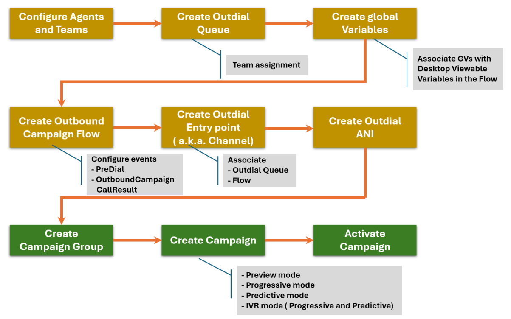
<figcaption>High-level outbound campaign configuration workflow — from Bad Experience 
detection to API-driven contact injection and live outbound call</figcaption>
</figure>

!!! info "How the API trigger fits in"
    In production, the Bad Experience detection system monitors every interaction in real 
    time. When any of the four detection rings fire and the interaction is confirmed as a 
    voice call, the system automatically calls the Campaign Manager API to inject the 
    customer's record into the active campaign. The campaign dialler picks up the record 
    and places the outbound call — no manual intervention required. In this lab, **you will 
    simulate that API call manually** using a REST client, so you understand exactly what 
    the system does under the hood.

In this bonus lab you will perform the following tasks:

1. Configure a team
2. Create an Outdial Queue
3. Configure Global Variables and Wrap-up Codes
4. Build the Outbound Campaign Flow (Main + Event flows)
5. Create the Outdial Entry Point (Channel) and Outdial ANI
6. Complete Campaign Manager prerequisites
7. Create, configure, and activate the Campaign
8. Inject a contact via API and validate the end-to-end flow

---

## Lab 5.1 - Configure a Team

### Create a Team

Even though no agent will be handling calls during the IVR campaign, creating a **team** and assigning it to the **outdial queue** is mandatory. The Entry Point requires an associated queue, and a queue requires a team.

???+ webex "Create Team"

    !!! important "Sandbox — Team Already Provisioned"
        In this sandbox environment, the team has already been created for you. Navigate to **Contact Center** → **Teams** and locate your pre-provisioned team (i.e. Sandbox Team AgentType - xxx). You do not need to create a new team. **Note this team name** — you will need it when configuring the Outdial Queue in the next step.

    If you are running this lab outside of the sandbox environment, click **Create a team** and fill in the following:

    | Field | Value |
    |---|---|
    | **Name** | `Bootcamp_Team` |
    | **Parent site** | `Site-1` |
    | **Team type** | `Agent-based` |
    | **Multimedia profile** | `Default_Multimedia_Profile` |
    | **Desktop layout** | `Global Layout` |

    Click **Create**.

    <figure markdown>
    
    <figcaption>Creating Bootcamp_Team with Agent-based type and Default Multimedia Profile</figcaption>
    </figure>

---

## Lab 5.2 - Create an Outdial Queue

The outdial queue connects your outbound campaign to the agent pool. It must be set to **Outbound queue** type and have the **Outbound campaign** toggle enabled.

???+ webex "Create Outdial Queue"

    If you are running this lab outside of the sandbox environment, click **Create a queue** and configure the following:

    | Field | Value |
    |---|---|
    | **Name** | `Bad_Experience` |
    | **Contact direction** | `Outbound queue` |
    | **Channel type** | `Telephony` |
    | **Outbound campaign** | Enabled (toggle ON) |
    | **Agent assignment** | `Teams` → select `Longest Available` |

    Under **Call distribution**, click **Create a group**, expand it, and select `Sandbox Team AgentType`.

    Fill in the mandatory **Advanced settings**:

    - **Service level threshold**: `200`
    - **Maximum time in queue**: `1200`
    - **Default music in queue**: `defaultmusic_on_hold.wav`

    Click **Create**.

    !!! note
        The **Contact direction** and **Channel type** fields cannot be changed after the queue is created. Double-check these values before clicking Create.

    <figure markdown>
    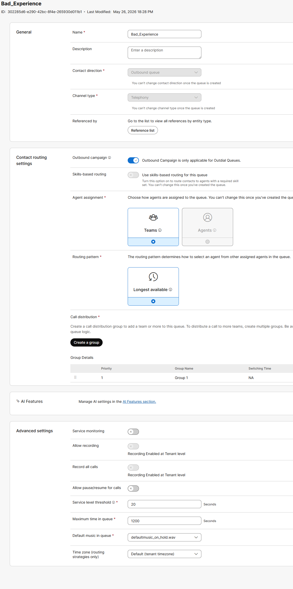
    <figcaption>Creating the Bad_Experience with Outbound queue direction and Outbound campaign enabled</figcaption>
    </figure>

## Lab 5.3 - Configure Global Variables

### Create Global Variables

Global Variables carry customer data from the contact list through the campaign flow and display it on the Agent Desktop. These variables are populated by the Bad Experience detection system when it injects a contact record via API.

???+ webex "Create Global Variables"

    1. In Control Hub, navigate to **Contact Center** → **Flows** → **Global Variables**.
    2. Click **Create a global variable** and configure the **firstName** variable:

        | Field | Value |
        |---|---|
        | **Name** | `firstName` |
        | **Description** | `firstName` |
        | **Variable type** | `String` |
        | **Make reportable** | Enabled |
        | **Make agent viewable** | Enabled |
        | **Desktop label** | `First Name` |
        | **Edit on desktop** | Disabled |

    3. Click **Create**.
    4. Repeat the process for each of the following variables:

        | Name | Desktop Label | Reportable | Agent Viewable |
        |---|---|---|---|
        | `lastName` | `Last Name` | Yes | Yes |
        | `Reason` | `Reason` | Yes | Yes |
        | `Status` | `Status` | Yes | Yes |
        | `ID` | `Transaction ID` | Yes | No |
        | `Comments` | `Comments` | Yes | Yes |

    !!! important
        All six variables must be added to every flow in this lab under **Global Flow Properties** → **Global Variables**.

    <figure markdown>
    
    <figcaption>Creating the firstName global variable with agent viewable and reportable settings enabled</figcaption>
    </figure>

---

## Lab 5.4 - Build the Flows

### Create the Outbound Campaign Flow

Before building the outbound campaign flow, you need a **destination flow**.

Now create the main outbound campaign flow. This flow handles the outbound dialling logic and routes calls based on the CPA (Call Progress Analysis) result.

???+ webex "Create Bad_Experience_Campaign Flow"

    1. In Control Hub, navigate to **Contact Center** → **Flows**.
    2. Click **Manage Flows -> Create Flows** and select **Flow** and **Start from scratch** in the next window. Click **Next**
    3. Name it <copy>`Bad_Experience_Campaign`</copy>.
    4. In the **Global Flow Properties** panel, click **Add global variables** and add all six variables:
        - `firstName`
        - `lastName`
        - `Reason`
        - `Status`
        - `ID`
        - `Comments`
    
    5. The Main flow canvas starts with a **NewPhoneContact** Start node.
    
        > Note the Start node might be **NewContact** instead.

        Connect it to an **End Flow** node as a placeholder — the actual logic is handled in Event flows.

    <figure markdown>
    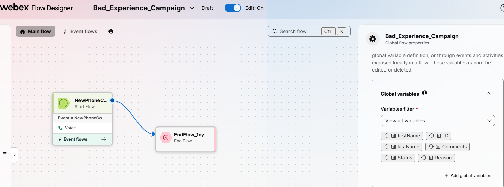
    <figcaption>Bad_Experience_Campaign flow showing Global Variables added to the flow configuration</figcaption>
    </figure>

#### Configure Event Flows

The campaign logic is driven by **Event flows**. Click on **Event flows** at the top of the flow builder to switch to the event flow canvas. You will configure one key event:

**OutboundCampaignCallResult**

This event fires when the dialler receives a CPA result for an outbound call attempt. It determines whether the call reached an answering machine, was abandoned, or reached a live conversation.

???+ webex "Configure OutboundCampaignCallResult Event"

    1. On the Event flows canvas, locate the **OutboundCampaignCallResult** event handler node.
    2. Drag a **Case** node onto the canvas and connect the **OutboundCampaignCallResult** event handler to it.
    3. Configure the **Case** node:
        - **Activity Label**: <copy>`Campaign_Results`</copy>
        - **Case variable**: `OutboundCampaignCallResult.CPAResult`  (this comes from the OutboundCampaignCallResult node)
        - Add the following case outputs:

            | Case | Value |
            |---|---|
            | **AMD** | <copy>`AMD`</copy> |
            | **ABANDONED** | <copy>`ABANDONED`</copy> |
            | **Default** | (default fallthrough) |

    4. Drag the StartMediaStream Node onto the canvas and connect the **AgentAccepted** to it.
    5. Drag the DisconnectCall Node onto the canvas and connect the **StartMediaStream** to it.

    <figure markdown style="width: 70%;">
    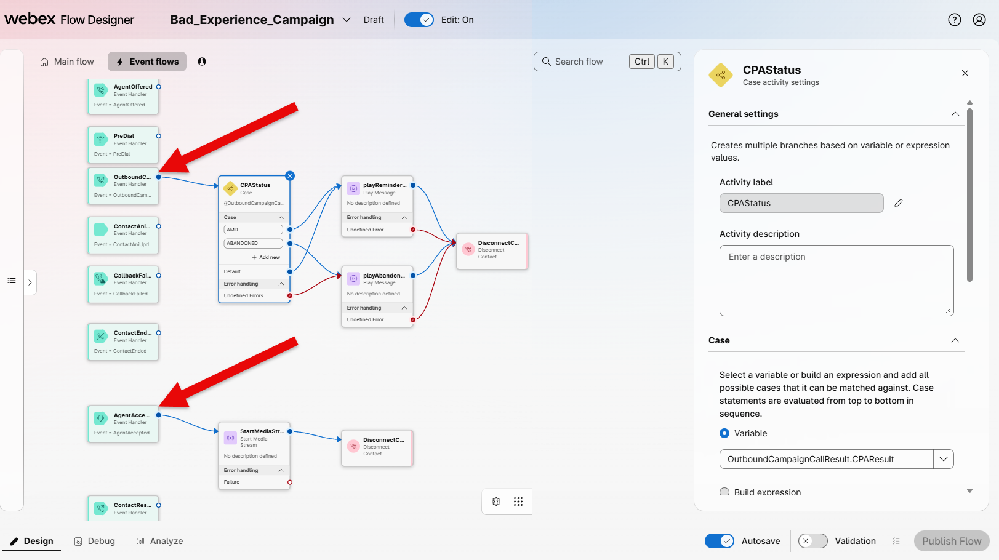
    <figcaption>Case node configured with CPAResult variable showing AMD and ABANDONED outputs</figcaption>
    </figure>


**Handling AMD and Abandoned outcomes:**

???+ webex "Configure AMD and Abandoned Routing"

    1. Drag a **Play Message** node onto the canvas.
    2. Connect both the **AMD** output of the Case node to this Play Message node.
    3. Configure the Play Message node:
        - Enable **Text-to-Speech**
        - **Connector**: `Cisco Cloud Text-to-Speech`
        - **Text-to-Speech Message**: `Hello, we are sorry for the inconvenience, please call us back when you can!`
    4. Drag and **End Flow** message to the canvas and connect the **Play Message** node to an **End Flow** node.
    5. Drag a **Play Message** node onto the canvas.
    6. Connect both the **ABANDONED** output of the Case node to this Play Message node.
    7. Configure the Play Message node:
        - Enable **Text-to-Speech**
        - **Connector**: `Cisco Cloud Text-to-Speech`
        - **Text-to-Speech Message**: `Sorry, we couldn't connect you to our agent right now. We will give you a callback later.`
    8. Drag and **End Flow** message to the canvas and connect both **Play Message** nodes to an **End Flow** node.

    9. Connect the **Undefined Errors** output of the **Case** node to the **End Flow** node.

    10. Enable the **Validation** slider to validate the flow and once validated, click **Publish Flow** to publish it. 

    Your **Outbound Bad_Experience_Campaign** flow is ready.  

    <figure markdown>
    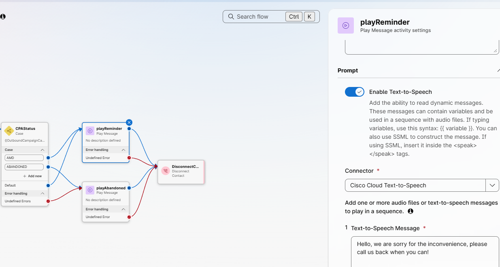
    <figcaption>Play Message node configured with TTS "Goodbye" for AMD and Abandoned call outcomes</figcaption>
    </figure>

---

## Lab 5.5 - Create the Outdial Entry Point (Channel) and Outdial ANI

### Create the Outdial Entry Point

The **Channel** Entry Point is the outbound telephony channel that ties together the flow, the outdial queue, and the dialling configuration.

???+ webex "Create Outdial Entry Point"

    Click **Create a channel** and configure the following:

    | Field | Value |
    |---|---|
    | **Name** | `Bad_Experience` |
    | **Channel type** | `Outbound telephony` |
    | **Service level threshold** | `30` seconds |
    | **Timezone** | `America/New_York` *(use your local timezone)* |
    | **Routing flow** | `Bad_Experience_Campaign` |
    | **Music on hold** | `defaultmusic_on_hold.wav` |
    | **Version label** | `Latest` |
    | **Outdial queue** | `Bad_Experience` |

    Click **Create**.

    <figure markdown>
    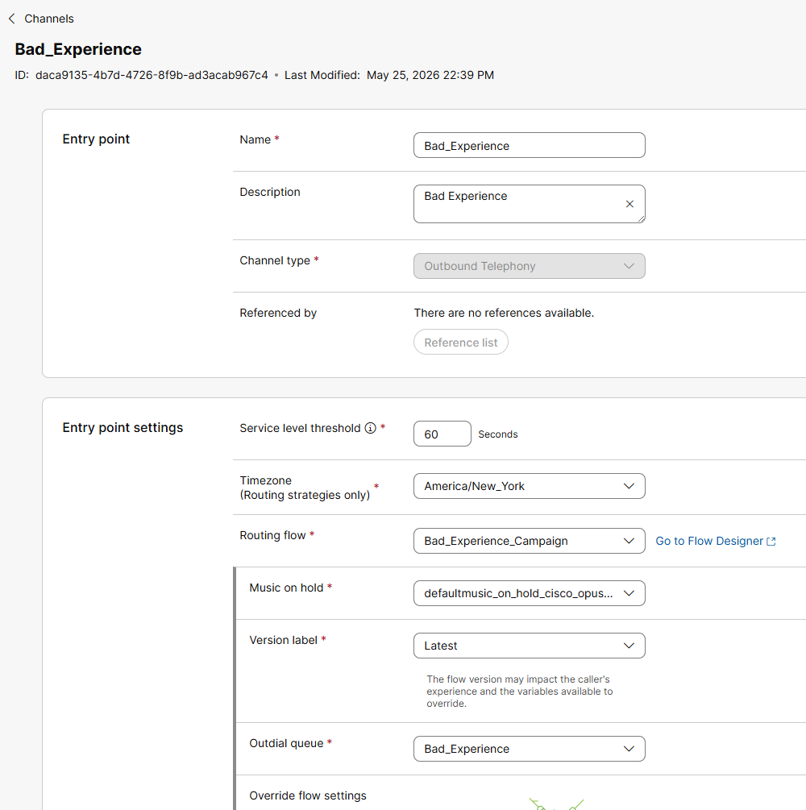
    <figcaption>Campaign_EP entry point configured with Outbound telephony, pointing to the Outbound_BadExperience flow and Bad_Experience</figcaption>
    </figure>

### Configure Outdial ANI

The Outdial ANI is the caller ID displayed to customers when they receive the outbound call.

???+ webex "Configure Outdial ANI"

    !!! important "Sandbox — Outdial ANI Already Provisioned"
        In this sandbox environment, the Outdial ANI has already been created for you. Navigate to **Contact Center** → **Outdial ANI** and locate your pre-provisioned ANI. Note the contact number — you will need to know it when configuring the Campaign dialler in Lab 5.6.

    If you are running this lab outside of the sandbox environment, click **Create** and configure the following:

    | Field | Value |
    |---|---|
    | **Name** | `Bootcamp_outANI` |

    Under **Entry list**, click **Add More** and add your PSTN numbers already configured in your environment:

    i.e.
    | Entry | Name | Contact number |
    |---|---|---|
    | 1 | `US-DIALOUT` | `+1350250xxxx` |
    | 2 | `PSTN` | `+44204620xxxx` |

    Click **Save**.

    <figure markdown>
    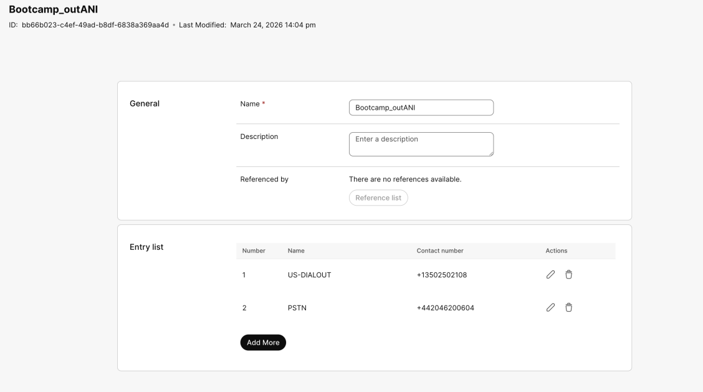
    <figcaption>Bootcamp_outANI configured with US and UK PSTN numbers for outdial caller ID</figcaption>
    </figure>

---

## Lab 5.6 - Campaign Manager Configuration

Open the **Webex Campaign Management** portal. On first login you will see the welcome screen outlining all the administration areas to configure before launching campaigns.

<figure markdown>
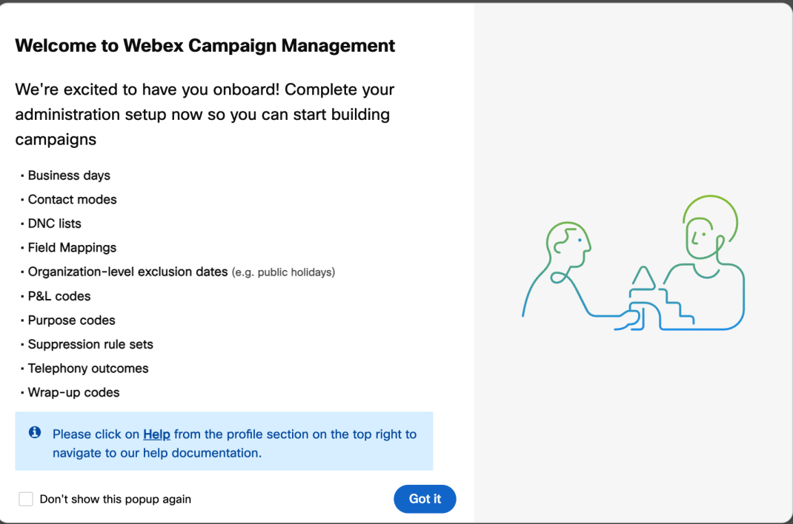
<figcaption>Welcome to Webex Campaign Management — administration checklist</figcaption>
</figure>

Complete each section in order as described below.

### Business Days

Business days are used solely for the purpose of contact list expiry calculation and have no association with Business Hours in Control Hub. We will not be configuring this section as part of this lab.

### Contact Modes

Contact modes define the type of phone number in your contact list (e.g. Home, Office, Mobile). For this lab we use a single contact mode mapped to the `phoneNumber` column in the contact list.

???+ webex "Create Contact Mode"

    1. Navigate to **Voice campaigns administration** → **Contact modes**.
    2. Click **Create contact mode** and fill in:

        | Field | Value |
        |---|---|
        | **Contact mode name** | `phone` |
        | **Contact mode type** | `Voice` |
        | **Minimum length** | `7` |
        | **Maximum length** | `15` |

    3. Click **Create contact mode**.

    <figure markdown style="width: 60%;">
    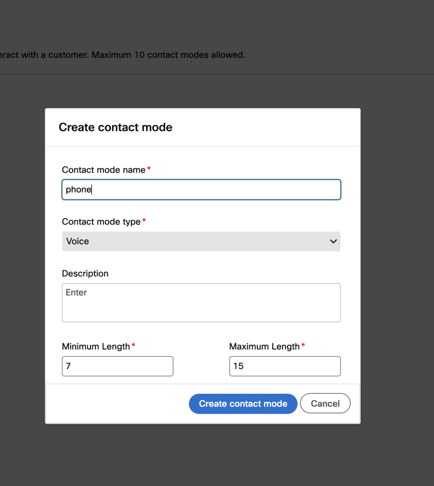
    <figcaption>Creating the phone contact mode with Voice type and default length constraints</figcaption>
    </figure>

### DNC Lists

Do Not Contact (DNC) lists prevent the campaign from calling restricted numbers. For this lab **no DNC list will be configured**.

!!! info
    In production environments you would upload DNC lists here to comply with regulatory requirements (e.g. national DNC registries). The campaign engine automatically suppresses any contacts matched against active DNC lists.

### Global Variables

Global variables are synced from Control Hub. They appear here for informational purposes — you cannot create or modify them in Campaign Manager.

???+ webex "Verify Global Variables"

    1. Navigate to **Voice campaigns administration** → **Global variables**.
    2. Verify that all six variables are listed with **Status: Active** and **Agent view: Yes**:

        - `firstName`
        - `lastName`
        - `Reason`
        - `Status`
        - `ID`
        - `Comments`

    !!! note
        If you don't see the variables, click **Refresh from Control Hub** at the top-right of the page.

    !!! important
        Before you can use Global Variables in Campaign Manager, you must designate a **customer-unique-identifier** and **account-unique-identifier** for compliance with call attempt regulations. For this lab, since we are not configuring unique identifiers, this step is skipped.

    <figure markdown>
    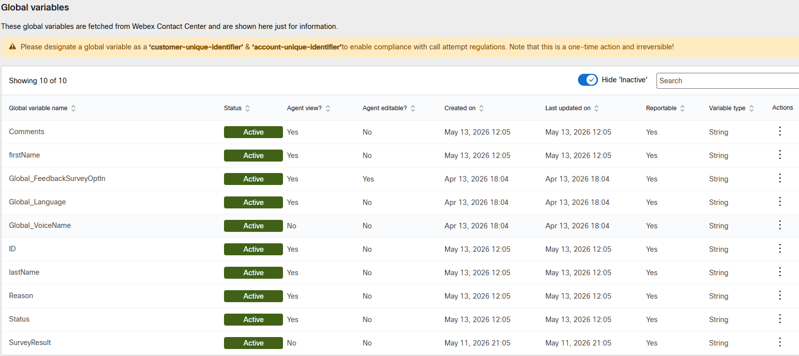
    <figcaption>Global variables list showing all six variables as Active and agent-viewable</figcaption>
    </figure>

### Field Mappings

Field mappings define how the columns in your contact list map to the Campaign Manager dialler system — including which column contains the phone number, which global variables carry the customer context, and the data types.

#### Prepare the Contact List CSV

Before creating the field mapping, prepare your contact list file. This file defines the schema that the Bad Experience system will use when injecting contacts via API.

???+ webex "Create Contact List CSV"

    Create a CSV file named `contact_list_bad_experience.csv` with the following structure:

    ```csv
    firstName,lastName,phoneNumber,Reason,Status,ID,Comments
    John,Smith,+12263762555,We noticed your recent experience did not go as expected,Frustrated,trans-001,Customer waited over 5 minutes and disconnected
    ```

    !!! note
        - All phone numbers must use E.164 format with the `+` prefix (e.g. `+12263762555`).
        - All rows within a single file must use numbers from the **same country**.
        - No spaces, hyphens, or special characters are permitted in the phone number field.
        - The CSV schema here mirrors exactly what the Bad Experience API injection sends — the field names must match precisely.

    <figure markdown>
    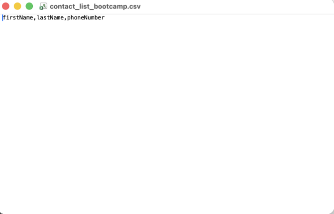
    <figcaption>contact_list_badExperience.csv showing the seven-column header structure</figcaption>
    </figure>

#### Create the Field Mapping

???+ webex "Create Field Mapping"

    1. Navigate to **Voice campaigns administration** → **Field mappings**.
    2. Click **Create field mapping**.
    3. Enter a **Field mapping name**: `BadExperience`

    **Step 1 — Upload sample file:**

    Click **Choose file** and select your `contact_list_badexperience.csv`. Once uploaded, the system displays the detected headers: `firstName`, `lastName`, `phoneNumber`, `Reason`, `Status`, `ID`, `Comments`.

    <figure markdown>
    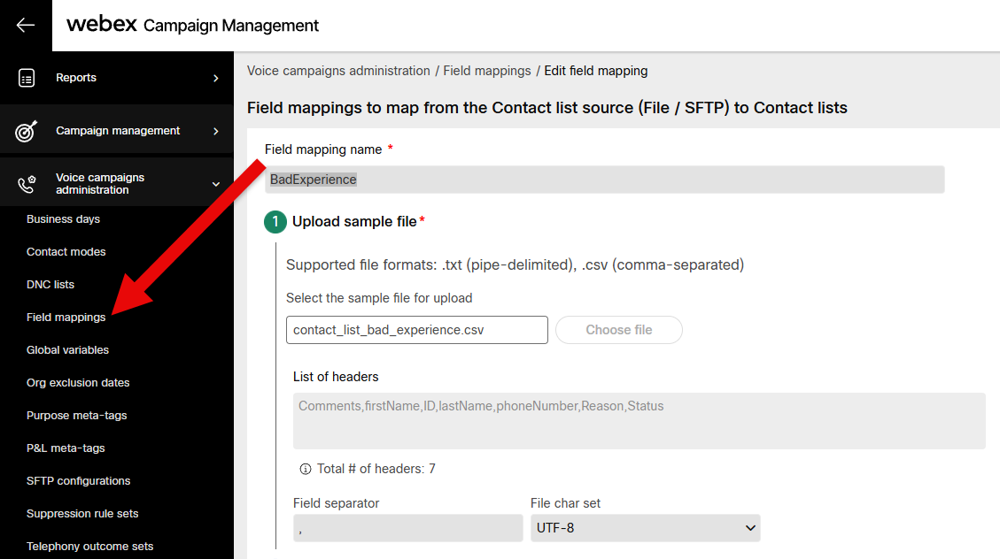
    <figcaption>Field mapping showing BadExperience field mapping with the uploaded CSV and 7 detected headers</figcaption>
    </figure>

    **Step 2 — Map contact modes:**

    Map the `phoneNumber` column to the `phone` contact mode created earlier. Leave all other columns as **Unmapped** at this stage.

    <figure markdown style="width: 60%;">
    
    <figcaption>Contact mode mapping showing phoneNumber mapped to the phone contact mode</figcaption>
    </figure>

    **Step 3 — Specify country of all phone numbers:**

    Select the appropriate country for your numbers and set the format to:
    `Prefixed with + sign and country code i.e. '+<country code><phone number>'`

    <figure markdown style="width: 80%;">
    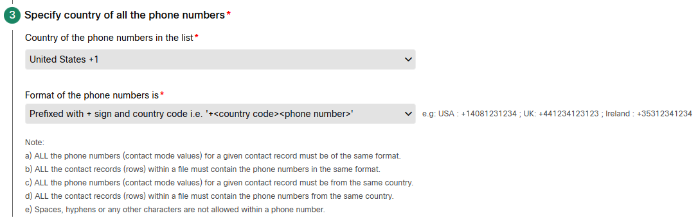
    <figcaption>Phone number format set to E.164 with + prefix and country code</figcaption>
    </figure>

    **Step 4 — Map source of timezones:**

    Keep the default configuration.

    **Step 5 — Map global variables:**

    Map each column to its corresponding Global Variable:

    | File header | Global variable | Data type |
    |---|---|---|
    | `firstName` | `firstName` | String |
    | `lastName` | `lastName` | String |
    | `Reason` | `Reason` | String |
    | `Status` | `Status` | String |
    | `ID` | `ID` | String |
    | `Comments` | `Comments` | String |
    | `phoneNumber` | Unmapped | N/A |

    <figure markdown>
    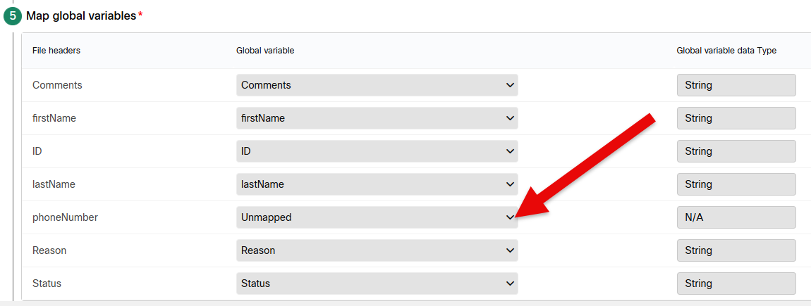
    <figcaption>All six global variables mapped to their corresponding CSV columns</figcaption>
    </figure>

    **Step 6 — Specify file header data types:**

    Leave all columns as **String** data type. Enable **PII protection** for `phoneNumber` if required by your organization's data handling policies.

    <figure markdown>
    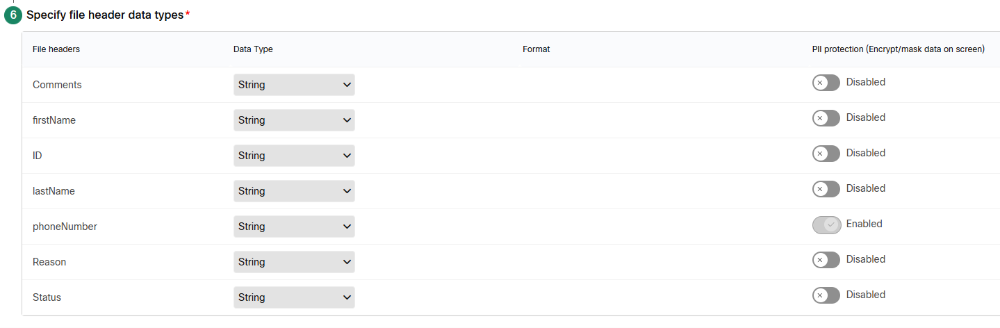
    <figcaption>File header data types: all set to String with PII protection enabled for phoneNumber</figcaption>
    </figure>

    Click **Save** to finalize the field mapping.

### Org Exclusion Dates

Organization-level exclusion dates prevent campaigns from running on specific dates such as national holidays. These exclusions apply to **all campaigns** in the organization.

???+ webex "Create Org Exclusion Date"

    1. Navigate to **Voice campaigns administration** → **Org exclusion dates**.
    2. Click **Create exclusion date** and add:

        | Exclusion date | Comment |
        |---|---|
        | `Dec 31, 2026` | `End of the Year` |

    3. Click **Save**.

    !!! info
        When a campaign is running and an exclusion date is reached, the campaign status automatically changes to **Pending** and calling stops. Once the exclusion date passes, the campaign automatically resumes with **Running** status.

    <figure markdown>
    
    <figcaption>Organization-level exclusion date set for 31 December 2026</figcaption>
    </figure>

### Purpose Meta-tags

Purpose meta-tags allow you to categorize campaigns by business function and are **mandatory for campaign activation**.

???+ webex "Create Purpose Meta-tag"

    1. Navigate to **Voice campaigns administration** → **Purpose meta-tags**.
    2. Click **Create purpose meta-tag** and configure:

        | Field | Value |
        |---|---|
        | **Purpose meta-tag** | `badExperience` |
        | **Purpose meta-tag group** | `DEFAULT` |

    3. Click **Update purpose meta-tag**.

    <figure markdown style="width: 70%;">
    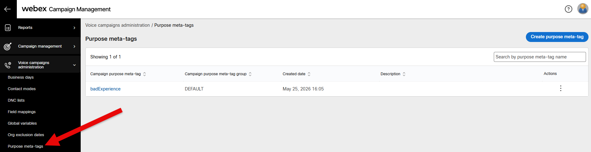
    <figcaption>Creating the badExperience purpose meta-tag under the DEFAULT group</figcaption>
    </figure>

### P&L Meta-tags

P&L (Profit and Loss) meta-tags assign campaigns to business divisions or cost centres and are **mandatory for campaign activation**.

???+ webex "Create P&L Meta-tag"

    1. Navigate to **Voice campaigns administration** → **P&L meta-tags**.
    2. Click **Create P&L meta-tag** and configure:

        | Field | Value |
        |---|---|
        | **P&L meta-tag name** | `badExperience` |
        | **P&L meta-tag description** | `Bad Experience Recovery` |

    3. Click **Save P&L meta-tag**.

    <figure markdown>
    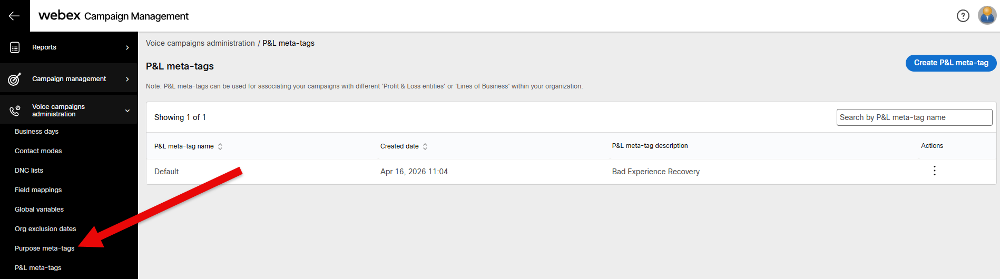
    <figcaption>P&L meta-tags list showing the badExperience tag created alongside the system Default tag</figcaption>
    </figure>

### Telephony Outcomes

A telephony outcome set defines how each possible call result (Busy, No Answer, AMD, etc.) is treated by the campaign — including whether it counts as a contact attempt and how long to wait before retrying.

The system provides a **primary read-only outcome set**. You must **duplicate** it to create a configurable version for your campaign.

???+ webex "Duplicate Telephony Outcome Set"

    1. Navigate to **Voice campaigns administration** → **Telephony outcome sets**.
    2. On the `Primary_telephony_outcome_set` row, click the **⋮ Actions** menu and select **Duplicate**.
    3. Enter the new name: `Bootcamp_Primary_telephony_outcome_set`
    4. Click **Duplicate**.

    The duplicated set will appear in your list. You can click on it to view all 20 telephony outcomes. For this lab, **leave all outcome values at their defaults**.

    <figure markdown>
    
    <figcaption>Telephony outcome sets list showing the system Primary set and the Duplicate action</figcaption>
    </figure>

    <figure markdown>
    
    <figcaption>Bootcamp_Primary_telephony_outcome_set showing all 20 telephony outcomes including AMD, ABANDONED, LIVE_VOICE, BUSY, and INVALID_NUMBER</figcaption>
    </figure>

### Wrap-up Code Sets

Wrap-up codes defined in Control Hub are synced to Campaign Manager. You can configure how each code affects future campaign contact attempts.

???+ webex "Configure Wrap-up Code Set"

    1. Navigate to **Voice campaigns administration** → **Wrap-up code sets**.
    2. Click **Create wrap-up code set** and enter the name: `BadExperience_wrapup_set`
    3. Click **Save**.

    <figure markdown>
    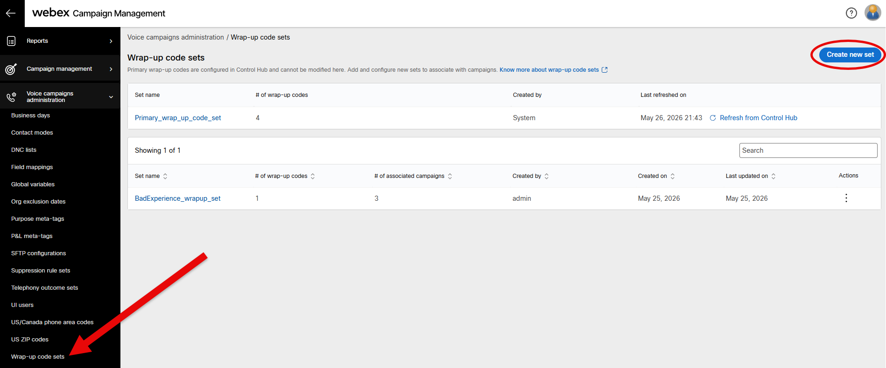
    <figcaption>Creating the BadExperience_wrapup_set</figcaption>
    </figure>

    4. Click on the new set and then **Add wrap-up codes**.
    5. Locate the `badExperience` wrap-up code synced from Control Hub and select it.

        ???+ info "Wrap-up Code Creation"
            This badExperience wrap-up code was created in lab 1 using Bruno.

    6. Click **Save**.

    <figure markdown>
    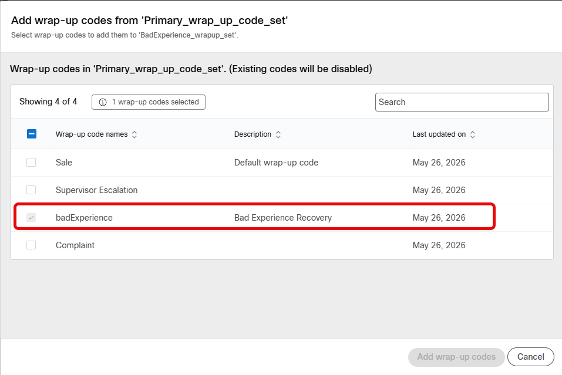
    <figcaption>badExperience wrap-up code added to the BadExperience_wrapup_set</figcaption>
    </figure>

    For more information refer to the [Wrap-up code sets documentation](https://docs-campaign-for-contact-centers.webexcampaign.com/docs/wrap-up-code-sets).

---

## Lab 5.7 - Campaign Management

With all prerequisites in place, you are ready to create the campaign group, configure the campaign, and activate it.

### Create a Campaign Group

A campaign group is a container for one or more campaigns. You must create the group before creating any campaigns inside it.

???+ webex "Create Campaign Group"

    1. In Campaign Manager's left navigation panel, navigate to **Campaign management** → **Campaign groups**.
    2. Click **Create campaign group** and enter:

        | Field | Value |
        |---|---|
        | **Campaign group name** | `Bad Experience` |

    3. Click **Save & proceed**.

    <figure markdown>
    
    <figcaption>Campaign groups list</figcaption>
    </figure>

    <figure markdown style="width: 80%;">
    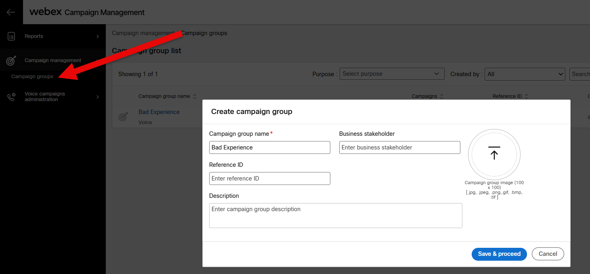
    <figcaption>Bad Experience campaign group created and ready for campaign configuration</figcaption>
    </figure>

### Create and Configure the Campaign

???+ webex "Create Campaign"

    1. Click on the **Bad Experience** campaign group.
    2. Click **Create campaign** in the top-right corner.

    <figure markdown>
    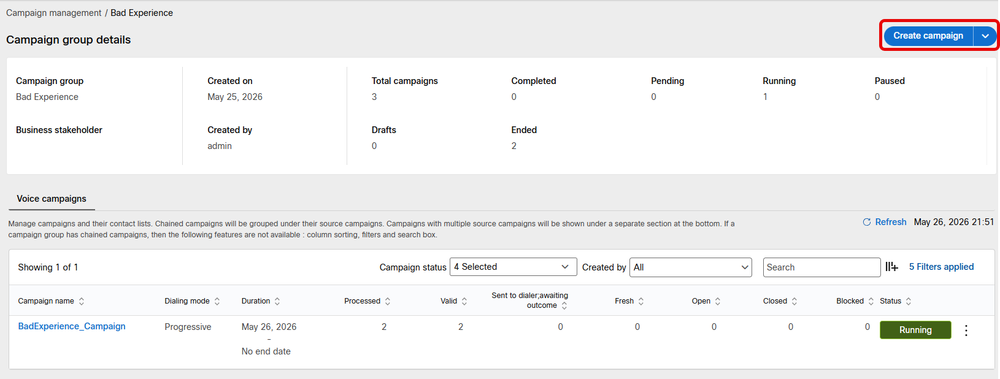
    <figcaption>Create campaign button inside the Bad Experience campaign group</figcaption>
    </figure>

    An untitled campaign opens with a visual node-based configuration canvas. Work through each node from left to right.

**Node 1 — Dialer configuration:**

???+ webex "Configure Dialer"

    In the **Dialer configuration** panel on the right side:

    | Field | Value |
    |---|---|
    | **Control Hub channel** | `Bad_Experience` |
    | **Outdial ANI** | *(select your pre-provisioned ANI)* |
    | **Dialing mode** | `Progressive` |
    | **CPA parameters** | Enabled (leave defaults) |
    | **# of contacts to be sent to the dialer in each push** | `100` |

    Click **Save changes**.

    <figure markdown>
    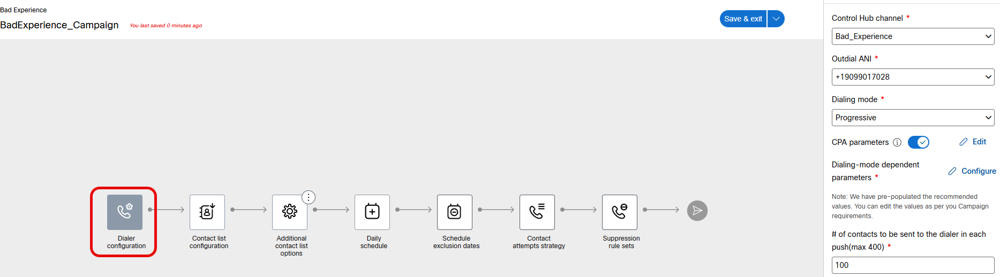
    <figcaption>Dialer configuration node pointing to Bad Experience Outdial Entry Point with Progressive mode enabled</figcaption>
    </figure>

**Node 2 — Contact list source:**

???+ webex "Configure Contact List Source"

    1. Click the **Contact list source** node.
    2. Configure the following:

        | Field | Value |
        |---|---|
        | **Select contact list source** | `Manual file upload` |
        | **Select field mapping** | `BadExperience` |
        | **Contact expiration** | `10 days` |

    3. Click **Save changes**.

    !!! note
        The actual contact list file will be uploaded after the campaign is activated. For now, just associate the field mapping.

    <figure markdown>
    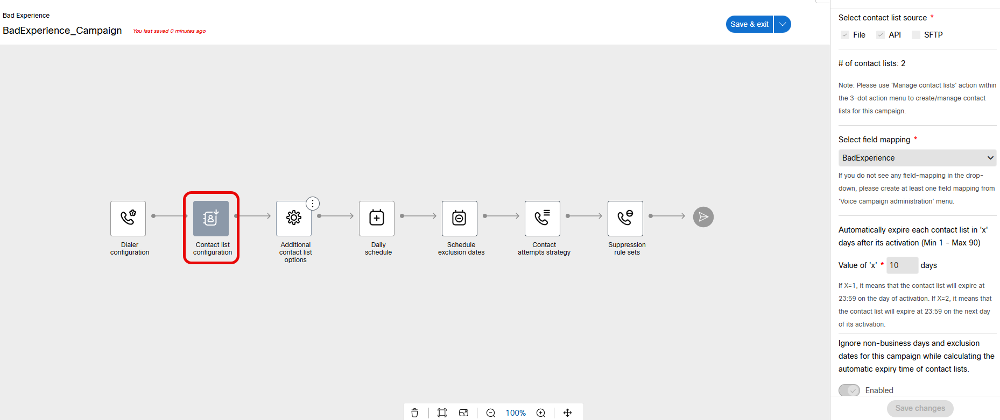
    <figcaption>Contact list source configured with BadExperience field mapping and 10 day expiration</figcaption>
    </figure>

**Node 3 — Daily schedule:**

???+ webex "Configure Daily Schedule"

    1. Click the **Daily schedule** node.
    2. Configure the calling window using your local timezone:

        | Field | Value |
        |---|---|
        | **Start time** | `09:00` |
        | **End time** | `21:00` |

    3. Click **Save changes**.

    <figure markdown>
    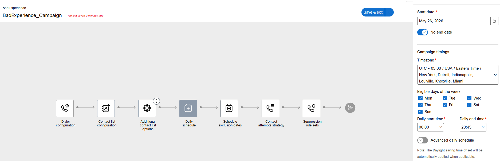
    <figcaption>Daily schedule configured with a 09:00 to 21:00 calling window</figcaption>
    </figure>

**Node 4 — Schedule exclusion dates:**

???+ webex "Configure Exclusion Dates"

    1. Click the **Schedule exclusion dates** node.
    2. Under **Organization-level exclusion dates**, the `End of the Year (Dec 31, 2026)` date you created earlier should appear automatically.
    3. Leave it checked (enabled).
    4. Click **Save changes**.

    <figure markdown>
    
    <figcaption>Organization-level exclusion date for Dec 31, 2026 automatically applied to the campaign</figcaption>
    </figure>

**Node 5 — Contact attempts strategy:**

???+ webex "Configure Contact Attempt Strategy"

    1. Click the **Contact attempts strategy** node, then click **Configure**.

    <figure markdown>
    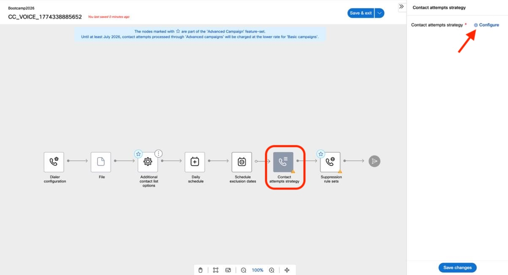
    <figcaption>Contact attempts strategy node — click Configure to open the settings panel</figcaption>
    </figure>

    2. Configure the following sections:

    **Section 1 — Call outcome sets:**

    | Field | Value |
    |---|---|
    | **Wrap-up code set** | `BadExperience_wrapup_set` |
    | **Telephony outcome set** | `Bootcamp_Primary_telephony_outcome_set` |

    **Section 2 — Contact mode priority:**

    The `phone` contact mode should be pre-populated from your field mapping. Leave priority at `1`.

    **Section 3 — Max call attempts:**

    | Timeframe | Max call attempts |
    |---|---|
    | Until the contact list expires | `40` |
    | In 1 day (from 00:01 to 23:59) | `4` |

    **Section 4 — Sequential dialling:**

    Disable sequential dialling and set the amount of contacts to `10`.

    Click **Save**.

    <figure markdown style="width: 60%;">
    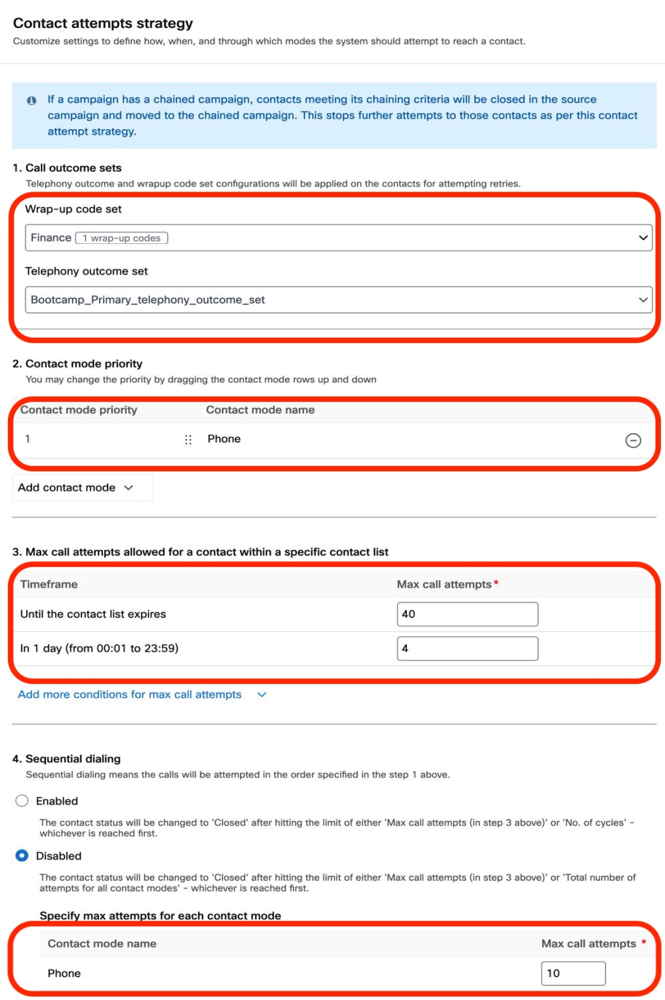
    <figcaption>Contact attempts strategy configured with BadExperience_wrapup_set and Bootcamp_Primary_telephony_outcome_set</figcaption>
    </figure>

    Back on the campaign flow canvas, click **Save changes** in the right panel.

**Node 6 — Suppression rule sets:**

???+ webex "Configure Suppression Rules"

    1. Click the **Suppression rule sets** node.
    2. Under **Suppression rule sets**, select `Suppression rules not required`.
    3. Click **Save changes**.

    <figure markdown>
    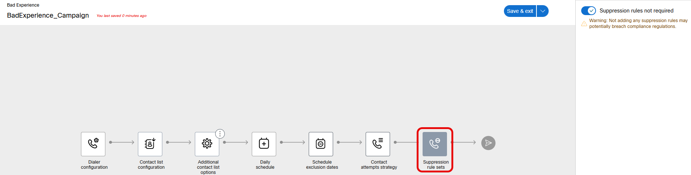
    <figcaption>Bootcamp_rule suppression rule set applied to the campaign</figcaption>
    </figure>

### Save and Activate the Campaign

???+ webex "Save Campaign"

    1. Click **Save & exit** in the top-right corner of the campaign flow canvas.
    2. In the **Save campaign** dialog, fill in:

        | Field | Value |
        |---|---|
        | **Campaign name** | `BadExperience_Campaign` |
        | **P&L meta-tag** | `badExperience` |
        | **Purpose meta-tag** | `badExperience` |
        | **Applicable DNC lists** | `None` |

    3. Click **Save**.

    <figure markdown>
    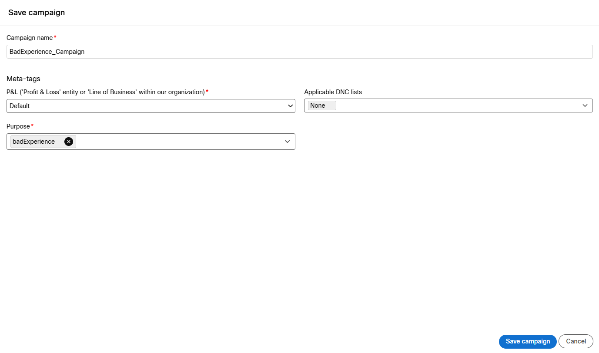
    <figcaption>Save campaign dialog with badExperience meta-tags applied</figcaption>
    </figure>

???+ webex "Activate Campaign"

    1. Back in the campaign group list, locate **BadExperience_Campaign** (status: **Draft**).
    2. Click the **⋮ Actions** menu and select **Activate**.
    3. In the confirmation dialog, click **Confirm**.

    The campaign status will change to **Pending** and then **Running**.

    !!! tip
        Campaign status is not refreshed in real time — click the **Refresh** button to get the updated status.

    <figure markdown>
    
    <figcaption>BadExperience_Campaign activated and transitioning from Draft to Running status</figcaption>
    </figure>

---

## Lab 5.8 - Upload Contact List and Test

Now that the campaign is active, you will perform a manual end-to-end validation by uploading a contact list CSV directly to the campaign. This confirms the full flow is working — from the dialler picking up the contact, through CPA detection, to the live voice routing and TTS message — before you move on to API-driven contact injection in Lab 5.9.

!!! info
    In production, the Bad Experience detection system injects contacts automatically via the Campaign Manager API — no manual upload is required. This step exists purely to validate your campaign infrastructure is correctly configured before introducing the API layer.

### Upload the Contact List

???+ webex "Upload Contact List"

    1. In the campaign list, click the **⋮ Actions** menu on **BadExperience_Campaign** and select **Manage contact lists**.

    <figure markdown>
    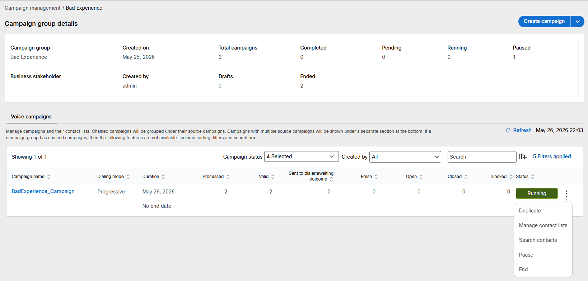
    <figcaption>Accessing the Manage contact lists option from the BadExperience_Campaign Actions menu</figcaption>
    </figure>

    2. Click **Upload file to create contact list**.

    <figure markdown>
    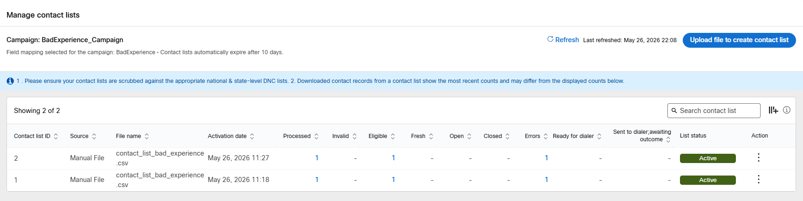
    <figcaption>Contact list upload option inside the campaign contact lists panel</figcaption>
    </figure>

    3. In the **Contact list from file upload** dialog, configure the following:

        | Field | Value |
        |---|---|
        | **Supported channels** | `Voice` (pre-selected) |
        | **Contact list type** | `Static` |
        | **Field mapping** | `BadExperience` (pre-selected) |
        | **Automatically activate** | Immediately after upload |
        | **In case of record issues** | Skip the particular record |

    4. Click **Browse** and select your `contact_list_bad_experience.csv`.
    5. Click **Save and proceed**.

    !!! warning
        If your contact list fails to upload, the most likely cause is a formatting issue with the CSV file. Check that:

        - Column headers match **exactly** what was defined in the field mapping (`firstName`, `lastName`, `phoneNumber`, `Reason`, `Status`, `ID`, `Comments`)
        - Phone numbers use E.164 format with the `+` prefix (e.g. `+12263762555`)
        - All phone numbers in the file are from the **same country**
        - No spaces, hyphens, or special characters appear in the phone number field
        - The file is saved as a proper comma-separated CSV (not semicolon or tab-separated)

    <figure markdown style="width: 70%;">
    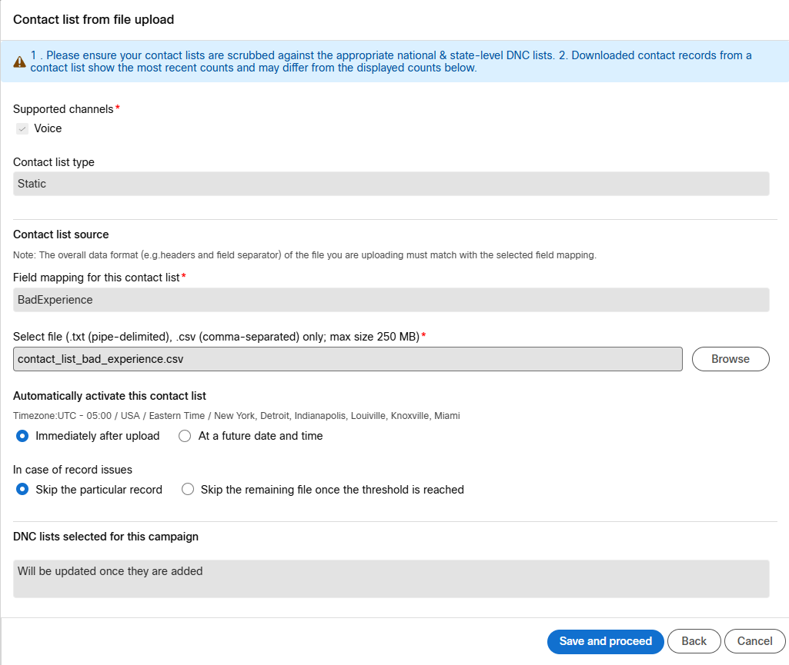
    <figcaption>Contact list upload form showing BadExperience field mapping, file selection, and activation settings</figcaption>
    </figure>

### Monitor Upload Status

After uploading, the contact list will show a status of **Uploading**, then transition to **Active** once processed. You will see the status move through: *Processed, Valid, Eligible*. Click **Refresh** to see the latest status.

<figure markdown>
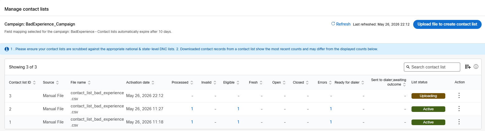
<figcaption>Contact list processing through upload states</figcaption>
</figure>

<figure markdown>
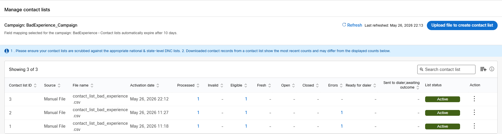
<figcaption>Contact list showing Active status and ready for dialling</figcaption>
</figure>

### Verify the Campaign is Running

Once the contact list is active, the Campaign Manager will begin pushing contacts to the dialler. **Allow 2–5 minutes** for the first calls to be generated.

Log your agent into the desktop https://desktop.wxcc-us1.cisco.com/, make sure you are available and wait until you receive your first call.

If everything is configured correctly, **you will receive a call** on the phone number in your contact list. When you answer you will hear:

<figure markdown>
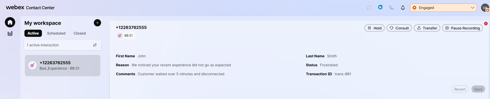
<figcaption>Contact list campaign running</figcaption>
</figure>

> *"Congratulations, You have received your FIRST Bad Experience Dialer call!"*

This confirms the full end-to-end flow is working — Campaign Manager initiated the call, CPA detected a live voice!

!!! note
    The **End Flow** node does not disconnect the call — you must hang up manually after testing. We have chosen **End Flow** over **Disconnect Contact** because the call will be routed to a queue in future labs.

---

## Lab 5.9 - API Contact Injection with Bruno

In the previous lab you validated the campaign by manually uploading a contact list CSV. In this lab you will simulate exactly what the Bad Experience detection system does automatically in production — injecting a customer record directly into the campaign via the Campaign Manager REST API using **Bruno**.

!!! info
    Bruno is a fast, lightweight API client that runs locally on your machine. If you don't have it installed, download it from [https://www.usebruno.com/](https://www.usebruno.com/).

### Understanding the API Flow

Before making any API calls, it is important to understand the three-step process the Bad Experience system follows every time it needs to trigger a proactive callback:

1. **Check for an active contact list** — query the campaign for any currently active API-sourced contact lists. If one exists, reuse it.
2. **Create a contact list** — if no active list exists, create a new one against the campaign.
3. **Inject the contact** — add the customer record to the active contact list. The dialler picks it up within seconds and places the outbound call.

<figure markdown>

<figcaption>Three-step API flow: check for active list → create if required → inject contact</figcaption>
</figure>

### Configure Bruno Environment

Before running the API calls, set up a Bruno environment with your campaign variables.

???+ webex "Set Up Bruno Environment"

    !!! important "Collection should already be created"
        In your Bruno import, the collection should already exist. Click the ellipsis menu for the collection.

    1. Open Bruno and create a new collection named `Campaign Manager`.
    2. Create a new environment named `Bootcamp` with the following variables:

        | Variable | Value |
        |---|---|
        | `baseUrl` | Campaign Manager base URL provided for your POD |
        | `campaignId` | Your `BadExperience_Campaign` campaign ID |
        | `contactListId` | *(leave blank — populated after Step 2)* |

    !!! tip
        To find your `campaignId`, navigate to your **BadExperience_Campaign** in Campaign Manager, open the campaign, and copy the ID from the URL or campaign details panel.

    <figure markdown>
    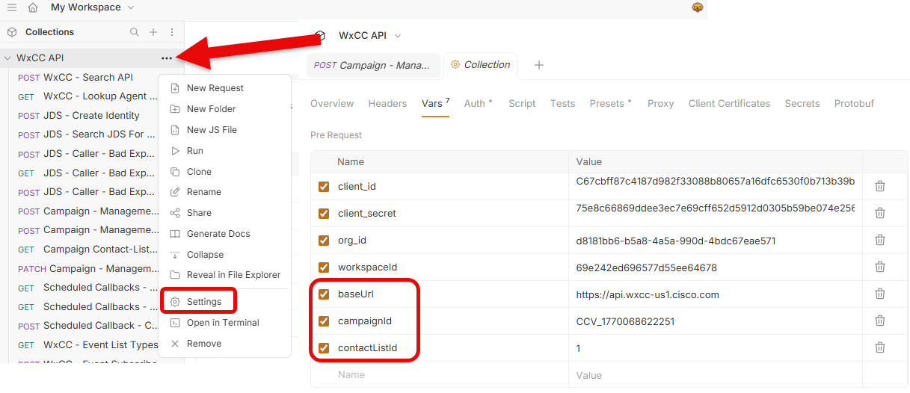
    <figcaption>Bruno Bad Experience environment configured with baseUrl and campaignId variables</figcaption>
    </figure>

### Step 1 — Check for an Active Contact List

First, query the campaign to determine whether an active API-sourced contact list already exists. If one does, you will skip Step 2 and proceed directly to Step 3.

???+ webex "GET Active Contact List"

    1. In Bruno, using existing request **Campaign - Management - Create Contact List** in the `WxCC API` collection:

        | Field | Value |
        |---|---|
        | **Method** | `GET` |
        | **URL** | `{{baseUrl}}/v3/campaign-management/campaigns/{{campaignId}}/contact-lists?status=Active&source=API` |

    2. Click **Send**.

    **What you are looking for in the response:**

    - **Empty array `[]`** — no active contact list exists. Proceed to Step 2 to create one.
    - **Array with one or more objects** — an active contact list exists. Copy the `id` value from the first object, save it as your `contactListId` environment variable, and skip to Step 3.

    <figure markdown>
    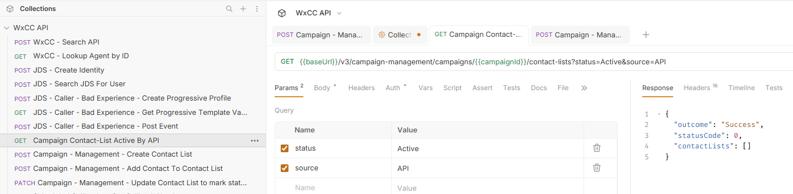
    <figcaption>Bruno GET response showing the active contact list lookup result</figcaption>
    </figure>

### Step 2 — Create a Contact List

If no active contact list was returned in Step 1, create a new one against the campaign.

???+ webex "POST Create Contact List"

    1. In Bruno, using existing request **Campaign - Management - Create Contact List** in the `WxCC API` collection:

        | Field | Value |
        |---|---|
        | **Method** | `POST` |
        | **URL** | `{{baseUrl}}/v3/campaign-management/campaigns/{{campaignId}}/contact-list` |

    2. You will see existing BODY below:

    ```json
    {
        "supportedChannels": ["Voice"],
        "activationTimeLagMinutes": 0
    }
    ```

    3. Click **Send**.

    **What you are looking for in the response:**

    - A `2xx Created` response containing the new contact list object.
    - Copy the `contactListId` value from the response and save it as your `contactListId` environment variable — you will need it in Step 3.

    <figure markdown>
    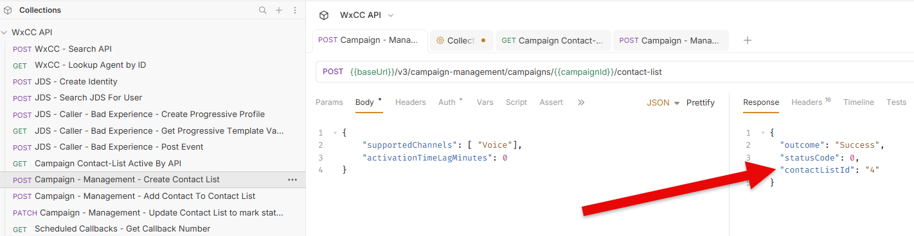
    <figcaption>Bruno POST response showing a newly created contact list and ID</figcaption>
    </figure>

### Step 3 — Inject the Contact

With an active contact list confirmed, inject the customer record into the campaign. The dialler will pick this up and place the outbound call within seconds.

???+ webex "POST Inject Contact"

    1. In Bruno, using existing request in the `WxCC API` collection:

        | Field | Value |
        |---|---|
        | **Method** | `POST` |
        | **URL** | `{{baseUrl}}/v3/campaign-management/campaigns/{{campaignId}}/contact-list/{{contactListId}}/contacts` |

    2. You will see existing BODY below:

    ```json
    {
        "contacts": [
            {
                "contactAttributes": [
                    {"fieldName": "firstName", "value": "John"},
                    {"fieldName": "lastName", "value": "Smith"},
                    {"fieldName": "phoneNumber", "value": "+12263762555"},
                    {"fieldName": "Reason", "value": "We noticed your recent experience did not go as expected"},
                    {"fieldName": "Status", "value": "Frustrated"},
                    {"fieldName": "ID", "value": "e64a72db-a97c-4fdb-9edc-5299883dbc0f"},
                    {"fieldName": "Comments", "value": "Customer waited over 5 minutes and disconnected"}
                ]
            }
        ]
    }
    ```

    3. Click **Send**.

    **What you are looking for in the response:**

    - A `200` or `201` response confirming the contact was accepted.
    - The dialler will begin processing the record immediately.

    !!! tip
        Update the `phoneNumber` value to your own number so you receive the test call directly.

    <figure markdown>
    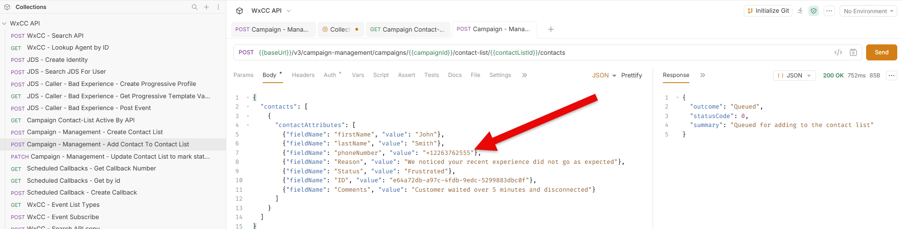
    <figcaption>Bruno POST response confirming successful contact injection</figcaption>
    </figure>

### Verify the Call

**Allow 2–5 minutes** after injecting the contact for the dialler to process the record and place the call.

Log your agent into the desktop https://desktop.wxcc-us1.cisco.com/, make sure you are available and wait until you receive your first call.

If everything is configured correctly, **you will receive a call** on the phone number in your contact list. When you answer you will hear:

> *"Congratulations, You have received your FIRST Bad Experience Dialer call!"*

This confirms that the API injection is working correctly — the Bad Experience system can now trigger proactive callbacks programmatically without any manual intervention.

!!! note
    If you do not receive a call within 5 minutes, check the following:

    - The campaign status is **Running** (not Pending or Paused)
    - The contact list status is **Active**
    - The phone number is in E.164 format with the `+` prefix
    - The suppression rule is not blocking the call based on the current time in the recipient's timezone

---

## Lab 5.10 - Webex Connect Integration

In this lab you will configure the Webex Connect integration that replicates the three API calls you tested manually in Bruno. Rather than building from scratch, you will modify the existing **WxCC Integration** node, clone the Search POST and modify the parameters for each method — authentication is already configured and does not need to be changed.

!!! info
    The WxCC Integration node contains three methods, each mapping directly to one of the Bruno API calls from Lab 5.9. You are simply pointing each method at the correct Campaign Manager endpoint with the correct payload.

### Clone the WxCC Integration Node

???+ webex "WxCC Integration Node"

    1. In your Webex Connect tenant, navigate to the **WxCC Integration** node.
    2. Clone the node and name the new node: `Campaign Manager`
    3. You will configure three methods inside this node — one for each API call.

    <figure markdown>
    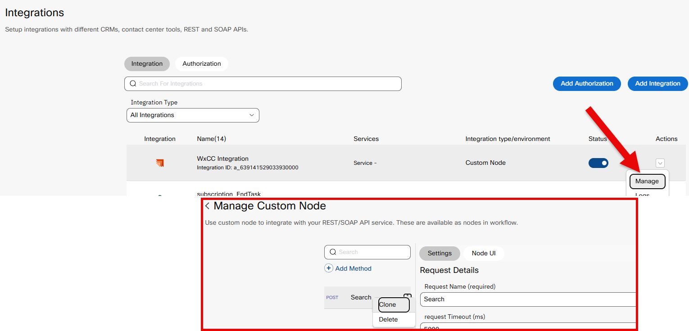
    <figcaption>WxCC Integration node and clone option</figcaption>
    </figure>

### Method 1 — Get Active Campaigns By Source and Campaign ID

This method checks whether an active API-sourced contact list already exists for the campaign. It maps directly to the GET request you made in Bruno Step 1.

???+ webex "Configure Get Active Campaigns By Source and Campaign ID"

    1. Inside the `WxCC Integration` node, locate the method named `Search`, then click the kebab menu ⋮ and choose **Clone**.
    2. Update the following: **Make sure you click on the method you just created**

        | Field | Value |
        |---|---|
        | **Name** | `Get Active Campaigns By Source and Campaign ID` |        
        | **Method** | `GET` |
        | **URL** | `https://api.wxcc-us1.cisco.com/v3/campaign-management/campaigns/$(CampaignID)/contact-lists?status=Active&source=API` |

    4. Click Parse Variables, change Parameter value type to Dynamic and put in a Field Name
   
    5. Leave all authentication settings as-is.
    6. Scroll to the bottom and add the following response parameters:

        | Parameter Name | Body | Response Path |
        |---|---|---|
        | `request_body` | `Body` | `$` |
        | `outcome` | `Body` | `$.outcome` |
        | `statusCode` | `Body` | `$.statusCode` |
        | `contactListId` | `Body` | `$.contactLists[0].contactListId` |
        | `contactListStatus` | `Body` | `$.contactLists[0].contactListStatus` |
        | `contactListRecordsProcessed` | `Body` | `$.contactLists[0].contactListRecordsProcessed` |
        | `contactListSource` | `Body` | `$.contactLists[0].contactListSource` |
        | `dateOfCreation` | `Body` | `$.contactLists[0].dateOfCreation` |
        | `dateOfActivation` | `Body` | `$.contactLists[0].dateOfActivation` |
        | `dateOfExpiry` | `Body` | `$.contactLists[0].dateOfExpiry` |

    7. Click **Test**, select the method name, and enter your Campaign ID to validate the response.

    <figure markdown>
    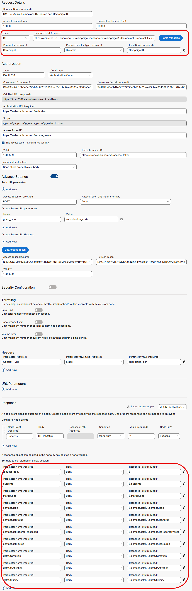
    <figcaption>Get Active Campaigns method with URL configured</figcaption>
    </figure>

### Method 2 — Create Contact List by Campaign ID

This method creates a new contact list against the campaign when no active list exists. It maps directly to the POST request you made in Bruno Step 2.

???+ webex "Configure Create Contact List by Campaign ID"

    1. Inside the `WxCC Integration` node, locate the method named `Get Active Campaigns By Source and Campaign ID`, then click the kebab menu ⋮ and choose **Clone**.
    2. Update the following: **Make sure you click on the method you just created**

        | Field | Value |
        |---|---|
        | **Name** | `Create Contact List by Campaign ID` |
        | **Method** | `POST` |
        | **URL** | `https://api.wxcc-us1.cisco.com/v3/campaign-management/campaigns/$(CampaignID)/contact-list` |

    4. Click Parse Variables, change Parameter value type to Dynamic and put in a Field Name
    3. Set the request body to:

    ```json
    {
        "supportedChannels": ["Voice"],
        "activationTimeLagMinutes": 0
    }
    ```

    4. Leave all authentication settings as-is.
    5. Scroll to the bottom and add the following response parameters:

        | Parameter Name | Body | Response Path |
        |---|---|---|
        | `request_body` | `Body` | `$` |
        | `outcome` | `Body` | `$.outcome` |
        | `statusCode` | `Body` | `$.statusCode` |
        | `contactListId` | `Body` | `$.contactLists[0].contactListId` |

    6. Save the method.
    7. Click **Test**, select the method name, and enter your Campaign ID to validate the response.

    <figure markdown>
    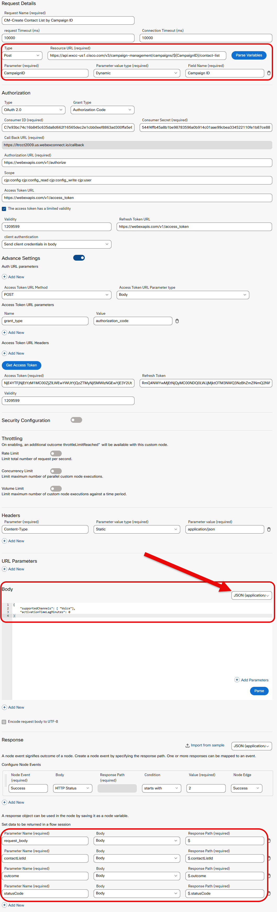
    <figcaption>Create Contact List method with URL and body configured</figcaption>
    </figure>

### Method 3 — Add Contact to Contact List

This method injects the customer record into the active contact list, triggering the outbound call. It maps directly to the POST request you made in Bruno Step 3.

???+ webex "Configure Add Contact to Contact List - badExperience"

    1. Inside the `WxCC Integration` node, locate the method named `Create Contact List by Campaign ID`, then click the kebab menu ⋮ and choose **Clone**.
    2. Update the following: **Make sure you click on the method you just created**

        | Field | Value |
        |---|---|
        | **Name** | `Add Contact to Contact List` |
        | **Method** | `POST` |
        | **URL** | `https://api.wxcc-us1.cisco.com/v3/campaign-management/campaigns/$(CampaignID)/contact-list/$(ContactListID)/contacts` |

    3. Leave all authentication settings as-is.
    4. Set the request body to:

    ```json
        {
        "contacts": [
            {
            "contactAttributes": [
                {"fieldName": "firstName", "value": "$(firstName)"},
                {"fieldName": "lastName", "value": "$(lastName)"},
                {"fieldName": "phoneNumber", "value": "$(phoneNumber)"},
                {"fieldName": "Reason", "value": "$(Reason)"},
                {"fieldName": "Status", "value": "$(Status)"},
                {"fieldName": "ID", "value": "$(ID)"},
                {"fieldName": "Comments", "value": "$(Comments)"}
            ]
            }
        ]
        }
    ```
    5. Now fill in all the dynamic parameters. This will be used to fill in the method on your custom node in a flow builder flow
        | Parameter | Parameter Value Type | Field Name |
        |---|---|---|
        | `firstName` | `Dynamic` | `First Name` |
        | `lastName` | `Dynamic` | `Last Name` |
        | `phoneNumber` | `Dynamic` | `Phone Number` |
        | `Reason` | `Dynamic` | `Reason` |
        | `Status` | `Dynamic` | `Status` |
        | `ID` | `Dynamic` | `ID` |
        | `Comments` | `Dynamic` | `Comments` |

    6. Scroll to the bottom and add the following response parameters:

        | Parameter Name | Body | Response Path |
        |---|---|---|
        | `request_body` | `Body` | `$` |
        | `outcome` | `Body` | `$.outcome` |
        | `statusCode` | `Body` | `$.statusCode` |

    7. Save the method.
    8. Click **Test**, select the method name, and enter your Campaign ID to validate the response.

    <figure markdown>
    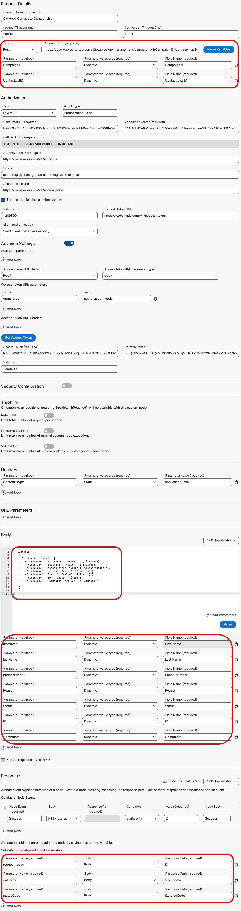
    <figcaption>Add Contact method with URL and mapped variable payload</figcaption>
    </figure>

### Test the Integration

If you have not tested the integrations above, run a quick end-to-end test to confirm the Webex Connect node is reaching the Campaign Manager API correctly.

???+ webex "Test WxConnect Integration"

    1. Trigger each method in sequence from the Webex Connect test console:
        - Run **Get Active Campaigns By Source and Campaign ID** — confirm you receive a valid response
        - If no active list exists, run **Create Contact List by Campaign ID** — confirm a `201` response
        - Run **Add Contact to Contact List - badExperience** — use your own phone number in the payload
    2. Confirm you receive a call on your phone and hear:

        > Log your agent into the desktop https://desktop.wxcc-us1.cisco.com/, make sure you are available and wait until you receive your first call.

    <figure markdown>
    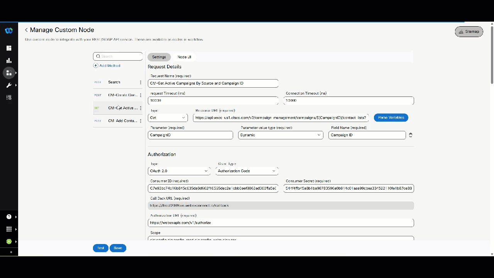
    <figcaption>Webex Connect integration test</figcaption>
    </figure>

---

## 5.11 — Implement in Bad Experience Event Flow

In this final step you will wire the Campaign Manager API call directly into the Bad Experience detection flow. When the system confirms a bad experience has been detected, Webex Connect will automatically inject the customer into the campaign — initiating the proactive callback without any manual intervention.

### Flow Nodes Overview

The Bad Experience event flow is made up of six pre-provisioned nodes. Each node evaluates a different signal from the interaction and sets a ring variable that the final node uses to determine whether a callback should be triggered. The sections below describe what each node does and why it exists.

???- info "BE - Explicit Survey Pain - 1"
    **Ring:** `bx_ring1`

    This node reads the customer's post-interaction survey score from the `GV_SurveyResponse_value` field. If the customer submitted a score of 1 or 2 out of 5, the ring fires. This is the strongest bad experience signal available — the customer explicitly told us they were unhappy.

???- info "BE - Implicit Survey Pain - 2"
    **Ring:** `bx_ring2`

    When no survey was completed, this node falls back to the AI-predicted satisfaction score (`autoCsat`). If the predicted score is 2 or below and no survey score exists, the ring fires. This ensures customers who hung up before completing a survey are still caught by the detection system.

???- info "BE - Agent Wrap-Code Pain - 3"
    **Ring:** `bx_ring3`

    This node checks the wrap-up code the agent selected at the end of the interaction. If the code matches a predefined list of negative dispositions — such as `Complaint` or `Supervisor Escalation` — the ring fires. This captures situations where the agent recognized the interaction went poorly even if the customer did not say so directly.

???- info "BE - Behavioral Pain - 4"
    **Ring:** `bx_ring4`

    This node detects friction signals embedded in the interaction data itself. Any one of the following will fire the ring:

    - Escalation events such as transfers, consults or conferences
    - Rage disconnect — customer hung up within 60 seconds of connecting
    - Hold abandonment — customer was placed on hold for more than 2 minutes and then disconnected
    - Negative sentiment — NLP compound score below -0.3
    - Queue or treatment abandon before reaching an agent
    - Hold abandon detected by walking the activity node chain — a platform blind spot the node works around explicitly

    When the ring fires, `bx_behavioralPain` is populated with a colon-separated string describing every signal that triggered, which is surfaced directly in the `Reason` field on the agent screen pop.

???- info "Msg for Dialer + verify rings"
    This node builds the three outbound campaign fields the agent sees on their screen pop — `Reason`, `Status` and `Comments` — using the ring globals and caller scoring set by the previous four nodes.

    - **Reason** — appends a plain-English label for every ring that fired, separated by ` : `
    - **Status** — surfaces the caller's emotional state derived from `autoCsat` and `sentimentScore`, along with which rings fired
    - **Comments** — delivers churn risk tier and recommended agent action based on emotional state

    The node returns `1` if any ring fired, `0` if none did. The flow branches on this output.

???- info "Voice Call?"
    This node confirms the interaction is a voice call by checking `channelType == telephony`. If the condition is not met the flow exits without triggering a callback. This ensures the Campaign Manager API call is only made for telephony interactions.

### Understanding the Trigger Point

Two conditions must be true before the flow proceeds to the Campaign Manager API call:

- **Msg for Dialer + verify rings** evaluates all four rings and returns `1` if any have fired, `0` if none have
- **Voice Call?** confirms the interaction is a voice call — `channelType == telephony`

If either condition is not met the flow exits without triggering a callback.

<figure markdown>
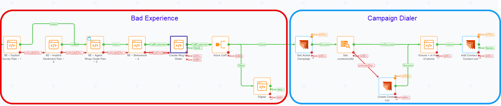
<figcaption>Screenshot showing Msg for Dialer + verify rings and the Voice Call branch point</figcaption>
</figure>

### Update the Bad Experience Event Flow

???+ webex "Add Get Active Campaign"

    1. Open the **Bad Experience Event Flow** in the WxCC Flow Builder.

        !!! note
            [Navigate to Service - Event Subscription and open **Process Events with Search and Campaign** ]

    2. Locate Evaluate Node **Get Active Campaign** on the canvas.
    3. Delete the node and add in your new WxCC Integration node (note your svg image may be different)
    4. Open the node and rename it to: 'Get Active Campaign' (move your mouse near the end of the existing title and then click on the pencil [click checkmark when done])
    5. Click the Method Name dropdown and choose **Get Active Campaigns By Source and Campaign ID**
    6. In Campaign ID field, add the variable $(CampaignID)
    7. On the right of screen, click Custom Variables, find CampaignID, click the pencil and add your campaign ID. Click Save when complete 
    8. Connect the **WxCC Integration** success (green) branch to the Get contactListId node
    9. Red invalid branch nodes do not need to be connected for this flow to work, however you can click and drag the branch lines and select 'Error'
    
    <div style="position: relative; padding-bottom: 56.25%; height: 0; overflow: hidden;">
    <iframe
        src="https://app.vidcast.io/share/embed/3e1a3c57-1a82-490e-859a-344da7b3b423?disableAMA=1&disableCopyDropdown=1"
        style="position: absolute; top: 0; left: 0; width: 100%; height: 100%;"
        frameborder="0"
        allowfullscreen>
    </iframe>
    </div>

???+ webex "Update Get contactListId"

    1. Locate the **Get contactListId** node on the canvas.
    2. Open the node and click the **Configuration** tab.
    3. Set the **Input Data Form** field to `$(<Get Active Campaign Node Number>.request_body)`

        !!! note
            To find the correct node number, click the **Get Active Campaign** node on the canvas. The node number is displayed in the bottom left of the node panel. Replace `<Get Active Campaign Node Number>` with that value — for example `$(n1567.request_body)` **or** find the node in the input variables and click on request_body.

        <figure markdown>
        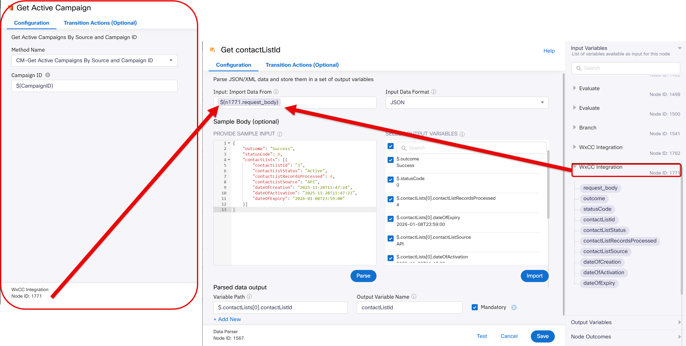
        <figcaption>Get contactListId — Input Data Form configuration</figcaption>
        </figure>

    4. Click the **Transition Actions** tab.
    5. In **Action 1**, update the **Value** field to match the same node number — for example `$(n1567.contactListId)`

        !!! note
            Use the same node number you identified in step 3.

        <figure markdown>
        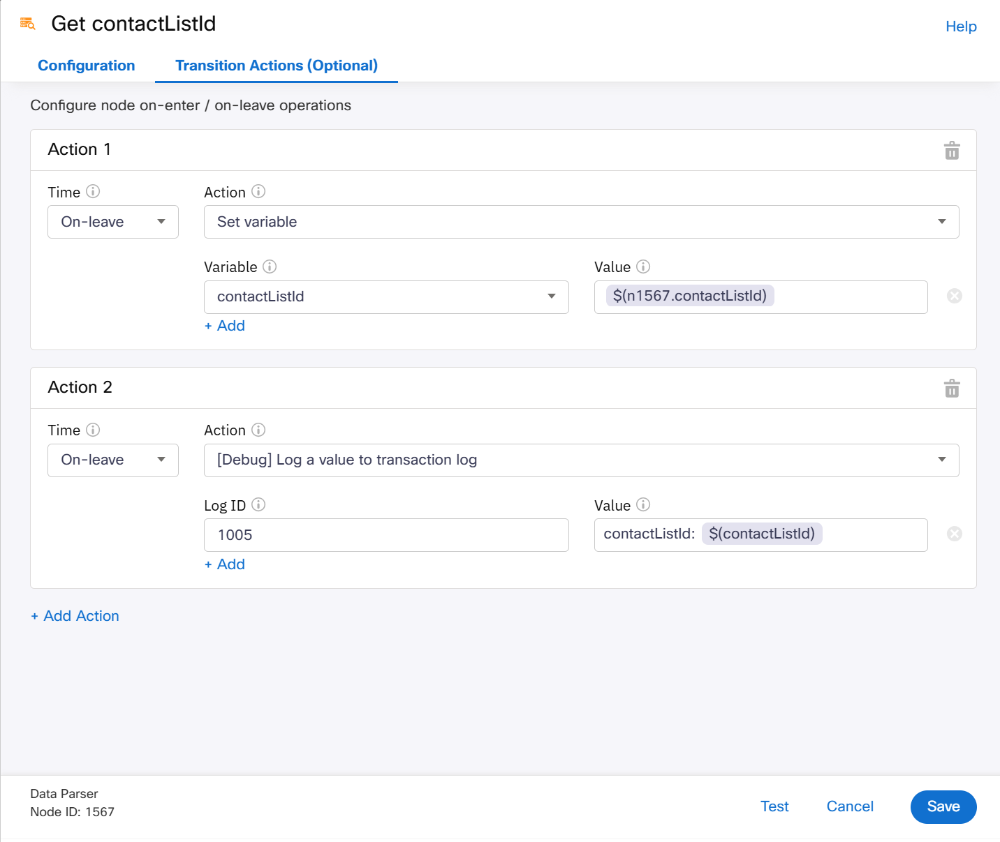
        <figcaption>Get contactListId — Transition Actions configuration</figcaption>
        </figure>

    6. Click **Save** when complete.
   
???+ webex "Add Create Contact List"

    1. Locate Evaluate Node **Create Contact List by Campaign** on the canvas.
    2. Delete the node and add in your new WxCC Integration node (note your svg image may be different) **notice the onInvalidData Line was disconnected**
    3. When you've moved over the new node, reconnect the deleted line from the get contactListId to the node you just moved
    4. Open the node and rename it to: 'Create Contact List by Campaign' (move your mouse near the end of the existing title and then click on the pencil [click checkmark when done])
    5. Click the Method Name dropdown and choose **Create Contact List by Campaign ID**
    6. In Campaign ID field, add the variable $(CampaignID)
    7. On the right of screen, click Custom Variables, find CampaignID, click the pencil and add your campaign ID. Click Save when complete 
    8. Click on **Transition Actions** to set the contactListId as a global variable

        1. Click **+ Add Action**
        2. Set **Time** to `On-leave`
        3. Set **Action** to `Set variable`
        4. Set **Variable** to `contactListId`
        5. For **Value**, click **Output Variables** in the bottom right and select `contactListId` to populate the field
        6. Click **+ Add Action** again
        7. Set **Time** to `On-leave`
        8. Set **Action** to `[Debug] Log a value to transaction log`
        9. Set **Log ID** to `1005`
        10. Set **Value** to `contactListId: $(contactListId)`

        <figure markdown>
        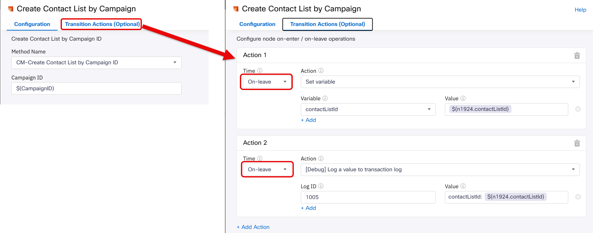
        <figcaption>Create Contact List by Campaign — Transition Actions configuration</figcaption>
        </figure>

    9. Connect the **WxCC Integration** success (green) branch to the **Ensure + in front of phone** node
    10. Red invalid branch nodes do not need to be connected for this flow to work, however you can click and drag the branch lines and select **Error**
       
    <div style="position: relative; padding-bottom: 56.25%; height: 0; overflow: hidden;">
    <iframe
        src="https://app.vidcast.io/share/embed/c6aefb05-a99a-49a7-b471-f7c231476f03?disableAMA=1&disableCopyDropdown=1"
        style="position: absolute; top: 0; left: 0; width: 100%; height: 100%;"
        frameborder="0"
        allowfullscreen>
    </iframe>
    </div>

???+ webex "Add Contact to Contact List"

    1. Locate Evaluate Node **Add Contact to Contact List** on the canvas.
    2. Delete the node and add in your new WxCC Integration node (note your svg image may be different)
    3. Open the node and rename it to: `Add Contact to Contact List` (move your mouse near the end of the existing title and then click on the pencil icon, click the checkmark when done)
    4. Click the **Method Name** dropdown and choose **CM-Add Contact to Contact List**
    5. Complete the fields as follows:

        | Field | Value |
        |---|---|
        | Campaign ID | `$(CampaignID)` |
        | Contact List ID | `$(contactListId)` |
        | First Name | `$(firstName)` |
        | Last Name | `$(lastName)` |
        | Phone Number | `$(Phone)` |
        | Reason | `$(Reason)` |
        | Status | `$(Status)` |
        | ID | `$(n2.inboundWebhook.data.taskId)` |
        | Comments | `$(Comments)` |

        <figure markdown>
        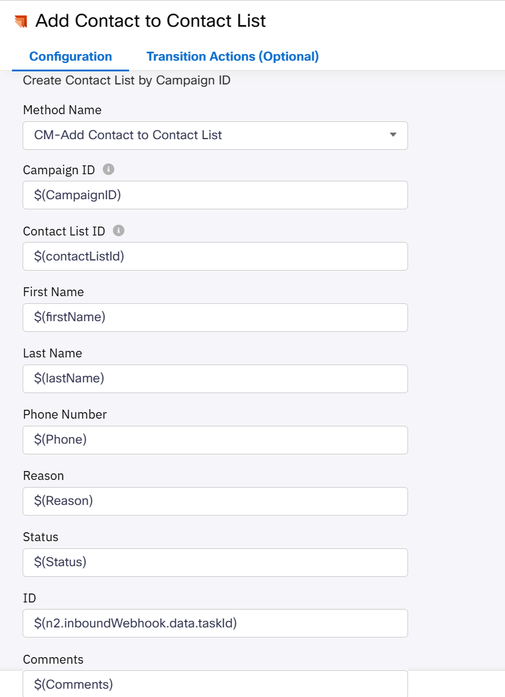
        <figcaption>Add Contact to Contact List — field configuration</figcaption>
        </figure>

    6. Connect the **Ensure + in front of phone** node to this node
    7. Connect the success (green) branch to the next node in the flow
    8. Red invalid branch nodes do not need to be connected for this flow to work, however you can click and drag the branch lines and select **Error**

    <div style="position: relative; padding-bottom: 56.25%; height: 0; overflow: hidden;">
    <iframe
        src="https://app.vidcast.io/share/embed/454a47ab-cad1-4f87-b3f3-06e7aa641963?disableAMA=1&disableCopyDropdown=1"
        style="position: absolute; top: 0; left: 0; width: 100%; height: 100%;"
        frameborder="0"
        allowfullscreen>
    </iframe>
    </div>

### Test End-to-End

With the flow published, trigger a bad experience to confirm the full automated chain works end to end.

???+ webex "End-to-End Test"

    1. Place a call into your contact center and do any of the following to fire one or more rings:

        - Submit a survey score of **1 or 2** when prompted after the call *(fires ring 1)*
        - Have the agent wrap up the call with the **Complaint** wrap code *(fires ring 3)*
        - Ask the agent to place you on hold, then hang up after 2 minutes *(fires ring 4)*

    2. Confirm in the Campaign Manager portal that your contact record appears with status **Eligible**
    3. **Wait for the callback** — you should receive a proactive outbound call within 2–5 minutes.
    4. Answer the call and confirm the agent screen pop shows:
        - **Reason** — reflecting the rings that fired
        - **Status** — showing the caller's emotional state
        - **Comments** — showing churn risk and recommended action

    !!! tip
        If the callback does not arrive, open turn on the debugger in WxConnect and review the flow results. Confirm **Msg for Dialer + verify rings** returned `1` and that **Voice Call?** branched to the success path.
        Click on the sprocket, turn on debugging put in mins to stay on, click save (do another call), then click on the bug!

        <figure markdown>
        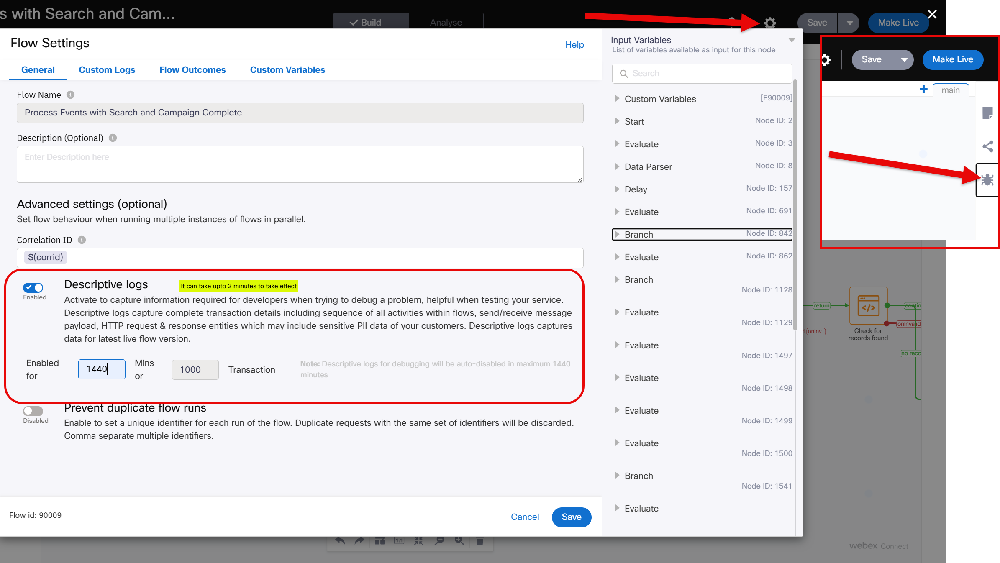
        <figcaption>Turn on Debugger and view your logs</figcaption>
        </figure>


---

## Lab Completion ✅

At this point you have successfully:

- ✅ Configured a team and outdial queue in Webex Contact Center
- ✅ Created all six Global Variables (`firstName`, `lastName`, `Reason`, `Status`, `ID`, `Comments`) for Bad Experience context propagation
- ✅ Built the `Bad_Experience_Campaign` flow with CPA-based routing (AMD, Abandoned, Live Voice)
- ✅ Configured the Outdial Entry Point and Outdial ANI
- ✅ Completed all Campaign Manager prerequisites (contact modes, field mappings, suppression rules, telephony outcomes, wrap-up codes, meta-tags)
- ✅ Created, configured, and activated the `BadExperience_Campaign` Progressive IVR campaign
- ✅ Validated the end-to-end flow with a manual CSV contact list upload
- ✅ Injected a contact via the Campaign Manager REST API using Bruno and received a live test call
- ✅ Configured the Webex Connect Campaign Manager integration node with all three methods
- ✅ Wired the Bad Experience detection flow — evaluating survey scores, auto-CSAT, agent wrap codes and behavioral signals across four detection rings
- ✅ Built the agent screen pop fields (`Reason`, `Status`, `Comments`) surfacing churn risk, emotional state and trigger context
- ✅ Connected the callback trigger into the Bad Experience Event Flow — fully automating the proactive outbound callback

**Congratulations!** The outbound campaign infrastructure is fully operational and the Bad Experience detection system is now connected end-to-end. When a customer has a bad experience, the system will automatically detect it, inject their record into the campaign, and trigger a proactive callback — all without manual intervention.
