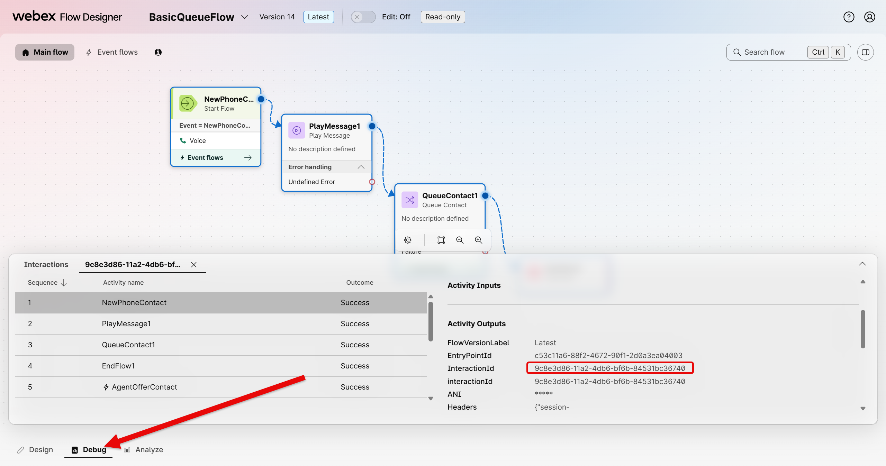
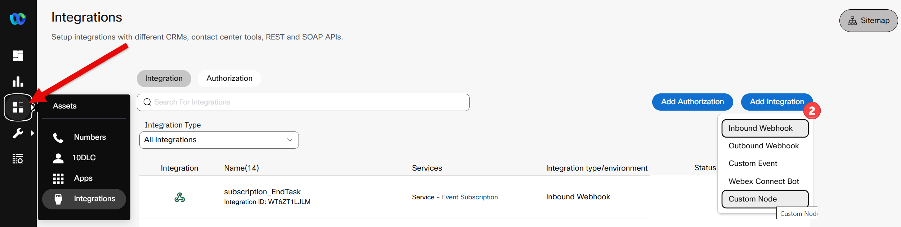
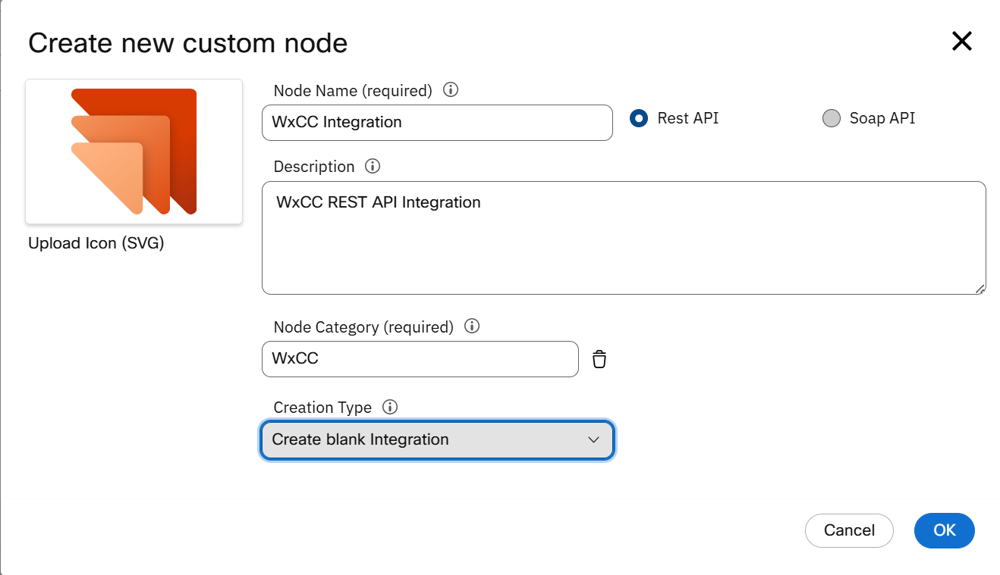
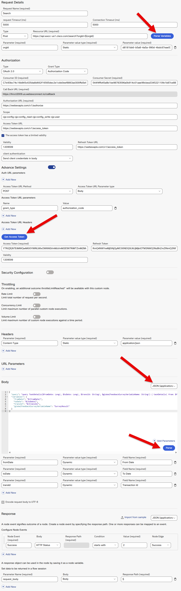

# Lab 4 - Search API :mag:

The WxCC Search API is a **GraphQL API** that gives you direct, flexible access to the interaction data recorded by Webex Contact Center. Unlike fixed REST endpoints that return a predefined set of fields, GraphQL lets you describe exactly what you want — request only the fields you need, filter by time range, interaction ID, agent, queue, channel type, and more, all in a single call.

The API exposes three core query types:

- **`taskDetails`** — Customer Session Records (CSRs) and Customer Activity Records (CARs): the full lifecycle of a contact interaction, including agent, queue, duration, sentiment, CSAT, wrap-up codes and global variables
- **`agentSession`** — Agent Session Records (ASRs) and Agent Activity Records (AARs): agent login/logout, channel activity and idle state data
- **`taskLegDetails`** — Call Leg Records (CLRs): per-queue leg data for queue-based reporting

**In this lab**, we use `taskDetails` to retrieve rich post-call data for a specific interaction — including AI-generated sentiment, auto-CSAT score, wrap-up code and survey response global variable — immediately after a call ends. This data feeds directly into the Bad Experience detection logic running in the Webex Connect event flow.

**Beyond this lab**, the same API can power real-time wallboards, custom CRM enrichment, supervisor dashboards, interaction search tools, compliance reporting and any downstream system that needs structured interaction data on demand.

???+ tip "API Docs"
    You can find the full Search API documentation <a href="https://developer.webex.com/webex-contact-center/docs/getting-started-with-search-api" target="_blank">here</a>

???+ warning
    Bruno client is installed on the laptop, do not use any web versions.

---

## Lab 4.1 - Time Utilities

Use these helpers to generate timestamps for API queries. Click **Refresh** to get the latest epoch values.

**Current epoch (milliseconds):** <code id="epoch-now-ms">0</code>  
**Current epoch - 24h (milliseconds):** <code id="epoch-minus-24h-ms">0</code>  

<button id="epoch-toggle-btn" class="md-button md-button--primary" type="button">Refresh</button>

???+ note
    Values populate when the page loads. Click **Refresh** to update with the current time for copying into your API client.

---

## Lab 4.2 - Test Search API in Bruno

In this section you will place a test call, have an agent answer it, and then query the Search API in Bruno to retrieve the full interaction record.

### Step 1: Place a Test Call

???+ webex "Place and Answer a Test Call"
    1. Sign in to the **Agent Desktop** at <a href="https://desktop.wxcc-us1.cisco.com/" target="_blank">https://desktop.wxcc-us1.cisco.com/</a> using the **User1** credentials provided for your POD.
    2. Set the agent to **Available**.
    3. From your phone, dial the **Entry Point number** provided in your POD credentials.
    4. Answer the call on the Agent Desktop.
    5. Have a short conversation (15–30 seconds), then end the call.
    6. Submit a wrap-up code on the Agent Desktop.
    7. Note the **Interaction ID** (also referred to as `taskId`) — you will need it in the next step. Easiest way is to go to your inbound flow, click on debug, pick your last entry, click on NewPhoneContact and copy the InteractionId from the Activity Outputs.

    !!! tip
        The Interaction ID is a UUID in the format `xxxxxxxx-xxxx-xxxx-xxxx-xxxxxxxxxxxx`. Copy it somewhere handy before proceeding.

    <figure markdown>
    
    <figcaption>Debug Flow to get InteractionId</figcaption>
    </figure>

### Step 2: Query the Search API

???+ webex "Run taskDetails Query in Bruno"
    1. Open **Bruno** on your lab laptop.
    2. In the **WxCC API** collection, locate the **POST** request named **`Search Task Details`**.
    3. Click on the **Body** tab and confirm the payload matches the following. Replace the three placeholder values with your own:

        - **`fromDate`** — use the **Current epoch - 24h** value from Lab 4.1
        - **`toDate`** — use the **Current epoch** value from Lab 4.1
        - **`transId`** — the Interaction ID from your test call above
        - **`globalFeedbackSurveyVariableName`** — leave as `SurveyResult`

        ```json
        {
          "query": "query TaskDetails($fromDate: Long!, $toDate: Long!, $transId: String!, $globalFeedbackSurveyVariableName: String!) { taskDetails( from: $fromDate, to: $toDate, timeComparator: createdTime, filter: { and: [ { id: { equals: $transId } } ] }, pagination: {} ) { tasks { abandonedType agentToAgentTransferCount autoCsat blindTransferCount conferenceCount connectedDuration consultToQueueCount csatScore GV_SurveyResponse: stringGlobalVariables(name: $globalFeedbackSurveyVariableName) { name value } holdDuration id isContactEscalatedToQueue lastQueue { name id } lastWrapupCodeName overflowCount owner { name id } sentiment terminatingEnd terminationType totalDuration } pageInfo { endCursor hasNextPage } intervalInfo { interval timezone } } }",
          "variables": {
            "fromDate": "REPLACE_WITH_EPOCH_MINUS_24H",
            "toDate": "REPLACE_WITH_EPOCH_NOW",
            "transId": "REPLACE_WITH_YOUR_INTERACTION_ID",
            "globalFeedbackSurveyVariableName": "SurveyResult"
          }
        }
        ```

    4. Click **Send**.
    5. Confirm you receive a `200 OK` response with a `tasks` array containing your interaction record.

    ???+ info "Understanding the Query"
        This query uses the `taskDetails` GraphQL operation to fetch a single interaction by ID within a 24-hour window. The `filter` narrows results to the exact `transId`. The `stringGlobalVariables` field — aliased as `GV_SurveyResponse` — retrieves the value of the `SurveyResult` global variable set during the call, which carries the customer's post-call survey score.

    ???+ info "Sample Response"
        A successful response will look similar to this:

        ```json
        {
        "data": {
            "taskDetails": {
            "tasks": [
                {
                "abandonedType": null,
                "agentToAgentTransferCount": null,
                "autoCsat": null,
                "blindTransferCount": 0,
                "conferenceCount": 0,
                "connectedDuration": 6663,
                "consultToQueueCount": 0,
                "csatScore": 0,
                "GV_SurveyResponse": {
                    "name": "SurveyResult",
                    "value": ""
                },
                "holdDuration": 13242,
                "id": "9c8e3d86-11a2-4db6-bf6b-84531bc36740",
                "isContactEscalatedToQueue": true,
                "lastQueue": {
                    "name": "Queue-1",
                    "id": "99fd0d26-f828-401d-a3a5-6cbc9b29ab34"
                },
                "lastWrapupCodeName": "Sale",
                "overflowCount": 0,
                "owner": {
                    "name": "User1 Agent1",
                    "id": "e75cad8e-8770-4654-8ea9-b63f358d7234"
                },
                "sentiment": null,
                "terminatingEnd": "Customer",
                "terminationType": "sudden_disconnect",
                "totalDuration": 30489
                }
            ],
            "pageInfo": {
                "endCursor": null,
                "hasNextPage": false
            },
            "intervalInfo": null
            }
        }
        }
        ```

    !!! success "Checkpoint"
        If you receive a `200 OK` with a populated `tasks` array, the Search API is reachable and returning interaction data correctly. Proceed to Lab 4.3.

    ???+ failure "Troubleshooting"
        - **Empty `tasks` array**: Confirm `fromDate` and `toDate` bracket the time of your call, and that `transId` matches exactly (case-sensitive UUID).
        - **`401 Unauthorized`**: Return to Lab 1.2 and refresh your Bruno access token.
        - **`400 Bad Request`**: Check the `variables` block — all four fields are required and `fromDate`/`toDate` must be string-quoted Long values.

---

## Lab 4.3 - Create the WxCC Integration Custom Node

Before adding the Search method, you need to create the **WxCC Integration** custom node in Webex Connect. This node is the foundation for all WxCC API calls made from within flows — including the Campaign Manager calls in Lab 5.

!!! important "This Step May Already Be Completed"
    If you completed **Lab 2**, the **WxCC Integration** custom node may already exist in your Webex Connect tenant. Navigate to **Assets → Integrations** and check for an existing node named `WxCC Integration`. If it is there, skip to **Lab 4.4**.
 
### Step 1: Download the Node Icon

???+ webex "Download the SVG Icon"
    1. Click the link below to download the node icon:

        <a href="./assets/wxcc_custom.svg" target="_blank">**wxcc_custom.svg**</a>

    2. Save the file somewhere accessible on your laptop — you will upload it in the next step.

### Step 2: Create the Custom Node

???+ webex "Create WxCC Integration Node"
    1. In Webex Connect, navigate to **Assets → Integrations**.
    2. Click **Add Integration** and select **Custom Node** from the menu.

        <figure markdown>
        
        <figcaption>Assets → Integrations page showing the Add Integration option</figcaption>
        </figure>

    3. In the **Create new custom node** dialog, configure the following:

        - **Node Icon** — drag `wxcc_custom.svg` into the **Upload Node Icon (SVG)** box or cilck the box and locate your svg image.
        - **Node Name** — `WxCC Integration`
        - **Description** — `WxCC REST API Integration`
        - **Node Category** — click Custom Category and type `WxCC` and select **Create custom category: WxCC** when it appears
        - **Creation Type** — `Create a blank integration`

        <figure markdown>
        
        <figcaption>Assets → Integrations page showing the Add Integration option</figcaption>
        </figure>

    4. Click **OK**.

    !!! note
        The node will open immediately after creation. You will add methods to it in the next steps.

---

## Lab 4.4 - Add Search Method to WxCC Integration Node
 
With the node created, you will now add the `Search` method. This is the method the flow will call to retrieve post-call interaction data from the WxCC Search API.
 
???+ webex "Add Search Method"
    1. Inside the **WxCC Integration** node, click **Add Method** (or click the ⋮ menu on any existing method and choose **Clone** if methods already exist — then update the clone).
    2. Configure the **Request Details** section:
 
        | Field | Value |
        |---|---|
        | **Request Name** | `Search` |
        | **Request Timeout (ms)** | `5000` |
        | **Connection Timeout (ms)** | `5000` |
        | **Type** | `Post` |
        | **Resource URL** | `https://api.wxcc-us1.cisco.com/search?orgId=$(orgId)` |
 
    3. Click **Parse Variables** (next to the Resource URL field). Add the following parameter:
 
        | Parameter | Parameter Value Type | Parameter Value |
        |---|---|---|
        | `orgId` | `Static` | *(paste your Organization ID from your POD credentials)* |
 
    4. Configure the **Authorization** section:
 
        | Field | Value |
        |---|---|
        | **Type** | `OAuth 2.0` |
        | **Grant Type** | `Authorization Code` |
        | **Consumer ID** | *(Client ID from the Webex Integration you created in Lab 1.1)* |
        | **Consumer Secret** | *(Client Secret from the Webex Integration you created in Lab 1.1)* |
        | **Authorization URL** | `https://webexapis.com/v1/authorize` |
        | **Scope** | `cjp:config cjp:config_read cjp:config_write cjp:user` |
        | **Access Token URL** | `https://webexapis.com/v1/access_token` |
        | **Validity** | `1209599` |
        | **Refresh Token URL** | `https://webexapis.com/v1/access_token` |
        | **Client Authentication** | `Send client credentials in body` |
 
    5. Under **Advance Settings**, confirm the following are set:
 
        | Field | Value |
        |---|---|
        | **Access Token URL Method** | `POST` |
        | **Access Token URL Parameter type** | `Body` |
        | **Access Token URL Parameters — Name** | `grant_type` |
        | **Access Token URL Parameters — Value** | `authorization_code` |
 
    6. Click **Get Access Token**. A Webex login window will appear — sign in using your POD admin credentials. Accept the requested permissions. Your **Access Token** and **Refresh Token** will populate automatically.
 
    7. Configure the **Headers** section:
 
        | Parameter | Parameter Value Type | Parameter Value |
        |---|---|---|
        | `Content-Type` | `Static` | `application/json` |
 
    8. Configure the **Body** section. Set the content type to `JSON (application/json)` and paste in the following:
 
        ```json
        {
          "query": "query TaskDetails($fromDate: Long!, $toDate: Long!, $transId: String!, $globalFeedbackSurveyVariableName: String!) { taskDetails( from: $fromDate, to: $toDate, timeComparator: createdTime, filter: { and: [ { id: { equals: $transId } } ] }, pagination: {} ) { tasks { abandonedType agentToAgentTransferCount autoCsat blindTransferCount conferenceCount connectedDuration consultToQueueCount csatScore GV_SurveyResponse: stringGlobalVariables(name: $globalFeedbackSurveyVariableName) { name value } holdDuration id isContactEscalatedToQueue lastQueue { name id } lastWrapupCodeName overflowCount owner { name id } sentiment terminatingEnd terminationType totalDuration } pageInfo { endCursor hasNextPage } intervalInfo { interval timezone } } }",
          "variables": {
            "fromDate": "$(fromDate)",
            "toDate": "$(toDate)",
            "transId": "$(transId)",
            "globalFeedbackSurveyVariableName": "SurveyResult"
          }
        }
        ```
 
        !!! note
            `globalFeedbackSurveyVariableName` is hardcoded to `SurveyResult` here. If your environment uses a different global variable name for the survey response, you could convert this to a dynamic parameter using the same pattern as `fromDate` and `transId`.
 
    9. Click **Parse** (inside the Body section). Configure the three dynamic input parameters:
 
        | Parameter | Parameter Value Type | Field Name |
        |---|---|---|
        | `fromDate` | `Dynamic` | `From Date` |
        | `toDate` | `Dynamic` | `To Date` |
        | `transId` | `Dynamic` | `Transaction ID` |
 
    10. Configure the **Response** section. Under **Configure Node Events**, confirm the following is set:
 
        | Node Event | Body | Response Path | Condition | Value | Node Edge |
        |---|---|---|---|---|---|
        | `Success` | `HTTP Status` | *(leave blank)* | `starts with` | `2` | `Success` |
 
    11. Under **Set data to be returned in a flow session**, add the following response parameter:
 
        | Parameter Name | Body | Response Path |
        |---|---|---|
        | `request_body` | `Body` | `$` |
 
    12. Click **Save**.
 
        <figure markdown>
        
        <figcaption>Create Method using OAUTH</figcaption>
        </figure>
---

## Lab 4.5 - Test in Webex Connect

Before wiring the `Search` method into the live flow, confirm it works correctly from the Webex Connect test console.

???+ webex "Test the Search Method"
    1. Inside the **WxCC Integration** node, click **Test**.
    2. Select the **Search** method from the dropdown.
    3. Enter the following test values:

        | Field | Value |
        |---|---|
        | `fromDate` | Current epoch - 24h (from Lab 4.1) |
        | `toDate` | Current epoch (from Lab 4.1) |
        | `transId` | Your Interaction ID from Lab 4.2 |

    4. Click **Test** and confirm you receive a valid response with the interaction data in `request_body`.

    !!! success "Checkpoint"
        A successful test confirms the WxCC Integration node can reach the Search API with the correct authentication and payload structure. Proceed to Lab 4.6.

    ???+ failure "Troubleshooting"
        - **`401 Unauthorized`**: Re-authorize the WxCC Integration node in Webex Connect.
        - **Empty response / no tasks**: Confirm the epoch timestamps bracket your test call and the `transId` is correct.
        - **`400 Bad Request`**: Verify the request body JSON is valid — pay close attention to the escaped quotes inside the `query` string.

---

## Lab 4.6 - Update the Process Events Flow

Now you will wire the `Search` method into the **Process Events with Search and Campaign Complete** event flow in Webex Connect. This flow already exists and is triggered by the Bad Experience detection system — you will add the Search API call as a new node so that interaction data is retrieved automatically for every flagged interaction.

???+ webex "Open the Flow"
    1. In Webex Connect, navigate to **Services**.
    2. Locate the service containing the **Process Events with Search and Campaign Complete** event subscription and open it.
    3. Open the flow in **Edit** mode.

???+ webex "Add the Search Node"
    1. From the node palette, drag a new **WxCC Integration** node onto the canvas at the appropriate point in the flow — after the interaction data is available but before the Bad Experience rings are evaluated.
    2. From the node palette, drag a new **WxCC Integration** node onto the canvas where the *Evaluate Node** called **Search** was located. Connect Green Success branch from the Get Start/End Time node.
    3. Open the node and rename it to: `Search` (click the pencil icon near the title, then click the checkmark when done).
    4. Click the **Method Name** dropdown and select **Search**.
    5. Complete the input fields as follows:

        | Field | Value |
        |---|---|
        | `fromDate` | *(epoch - 24h — use the appropriate flow variable or expression for the current time minus 24 hours)* |
        | `toDate` | *(current epoch — use the appropriate flow variable or expression)* |
        | `transId` | `$(n2.inboundWebhook.data.taskId)` |

    6. On the right panel, click **Transition Actions** and add the following:

        | Time | Action | Log ID | Value |
        |---|---|---|---|
        | `On-leave` | `[Debug] Log a value to transaction log` | `2001` | `Search response: $(Search.request_body)` |

    7. Connect the success (green) branch of the **Search** node to the next node in the flow.
    8. Update the Check for records found with the new node number of the WxCC Integration Node, then do the same for the Get Call Detail Data (data) node.
    9. Red invalid branch nodes do not need to be connected — you can drag those branch lines and assign them to the **Error** handler if one exists in the flow.

<div style="position: relative; padding-bottom: 56.25%; height: 0; overflow: hidden;">
  <iframe
    src="https://app.vidcast.io/share/embed/9d799f55-4893-4953-aba2-259ae2660ae3?disableAMA=1&disableCopyDropdown=1"
    style="position: absolute; top: 0; left: 0; width: 100%; height: 100%;"
    frameborder="0"
    allowfullscreen>
  </iframe>
</div>

???+ webex "Save and Publish"
    1. Click **Save** on the Search node.
    2. Enable the **Validation** slider at the bottom of the canvas and confirm there are no errors.
    3. Click **Save** on the flow, then **Make Live** to deploy the updated flow.

    !!! warning
        Publishing replaces the live version immediately. Confirm the flow validates cleanly before publishing.

---

## Lab 4.7 - Testing

With the flow live, you will now perform an end-to-end test to confirm the Search API call is firing correctly and returning data into the flow.

### Step 1: Enable Debug Logging

???+ webex "Turn On Debug Logs"
    1. In Services - Click on Event Subscription
    2. Click on Process Events with Search and In Webex Connect, navigate to the **Process Events with Search and Campaign Complete** service.
    3. Open the flow and confirm the **[Debug] Log** transition action you added in Lab 4.6 is in place on the Search node.
    4. Navigate to **Transaction Logs** so you are ready to inspect logs in real time.

### Step 2: Send a Test Call

???+ webex "Place a Call to Trigger the Flow"
    1. Sign in to the **Agent Desktop** and set the agent to **Available**.
    2. Dial the **Entry Point number** for your POD.
    3. Answer the call, hold a brief conversation, then end the call.
    4. Submit the **`badExperience`** wrap-up code on the Agent Desktop.

    !!! tip
        Using the `badExperience` wrap-up code fires ring 3 in the Bad Experience detection system, ensuring the flow proceeds past the detection gate and reaches the Search API call.

### Step 3: Verify Results

???+ webex "Inspect the Transaction Logs"
    1. In Webex Connect, open **Transaction Logs** for the **Process Events with Search and Campaign Complete** service.
    2. Locate the most recent transaction triggered by your test call.
    3. Find the log entry with **Log ID `2001`** and confirm the `request_body` value contains a valid Search API response with your interaction data.
    4. Confirm the `tasks` array in the response includes the expected fields:

        | Field | What to Check |
        |---|---|
        | `id` | Matches your test call Interaction ID |
        | `autoCsat` | A score between 1 and 5 |
        | `sentiment` | A decimal value between -1.0 and 1.0 |
        | `lastWrapupCodeName` | `badExperience` |
        | `GV_SurveyResponse.value` | Survey score if submitted, or `null` |
        | `owner.name` | Your test agent's name |

    !!! success "Checkpoint"
        If the log entry shows a populated `request_body` with interaction data matching your test call, the Search API is fully integrated into the Bad Experience event flow.

    ???+ failure "Troubleshooting"
        - **No transaction appears in logs**: Confirm the flow is published with the **Latest** version label and the event subscription is active.
        - **Search node shows error branch**: A `401` means re-authorization is needed on the WxCC Integration node. A `400` points to a malformed payload — verify the `transId` variable path `$(n2.inboundWebhook.data.taskId)` resolves correctly in your flow.
        - **`tasks` array is empty**: The call may have occurred outside the 24-hour window used for `fromDate`/`toDate`. Verify the epoch expressions resolve to values that bracket the call time.
        - **Log ID `2001` not visible**: Confirm the Transition Action was saved correctly on the Search node and the flow was republished after the change.

---

!!! success "Lab 4 Complete"
    - ✅ Search API queried successfully in Bruno against a live interaction
    - ✅ WxCC Integration custom node created in Webex Connect
    - ✅ `Search` method added and validated from the test console
    - ✅ Search node wired into the **Process Events with Search and Campaign Complete** flow
    - ✅ End-to-end test confirmed Search API response captured in transaction logs

Congratulations! You have completed Lab 4. Use the navigation menu on the left to proceed to **Lab 5**.